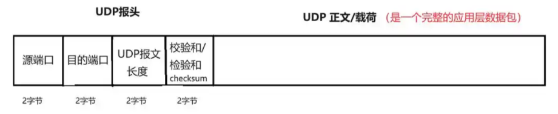

# 说明
根据简历中提到的知识点自己实现一番，并且将**相应的知识点**和**常见面试问题**进行总结。主要分为八个部分，算法、容器、C++新特性、设计模式、并发组件、计算机网络、数据库、常用开发工具命令。

**章节编号规范：**
- **一级标题**：一、算法
- **二级标题**：1.1 查找算法
- **三级标题**：1.1.1 二分查找
- **四级标题**：(1) 实现思路
- **五级标题**：(a) 步骤1  

# 目录
- [一、算法](#一算法)
  - [1.1 查找算法](#11-查找算法)
  - [1.2 排序算法](#12-排序算法)
- [二、数据结构和容器](#二数据结构和容器)
  - [2.1 vector](#21-vector)
  - [2.2 list](#22-list)
  - [2.3 哈希表（Hash Table）](#23-哈希表hash-table)
  - [2.4 deque](#24-deque)
  - [2.5 二叉树](#25-二叉树)
- [三、C++新特性](#三c新特性)
  - [3.1 智能指针](#31-智能指针)
  - [3.2 lambda 表达式](#32-lambada-表达式)
  - [3.3 functional](#33-functional)
  - [3.4 互斥锁与同步原语](#34-互斥锁与同步原语)
  - [3.5 右值引用、移动语义、完美转发](#35-右值引用移动语义完美转发)
  - [3.6 可变参数模板](#36-可变参数模板)
- [四、设计模式](#四设计模式)
  - [4.1 单例模式](#41-单例模式)
- [五、并发组件](#五并发组件)
  - [5.1 线程池](#51-线程池)
- [六、计算机网络](#六计算机网络)
  - [6.1 OSI七层网络模型](#61-osi七层网络模型)
  - [6.2 IP协议](#62-ip协议)
  - [6.3 ARP协议](#63-arp协议)
  - [6.4 ICMP协议](#64-icmp协议)
  - [6.5 UDP协议](#65-udp协议)
  - [6.6 TCP协议](#66-tcp协议)
  - [6.7 HTTP协议](#67-http协议)
  - [6.8 WebSocket协议](#68-websocket协议)
- [七、数据库(SQLite)](#七数据库sqlite)
  - [7.1 基本操作](#71-基本操作)
- [八、开发工具常用的命令](#八开发工具常用的命令)
  - [8.1 Linux常用命令](#81-linux常用命令)
  - [8.2 git常用命令](#82-git常用命令)
  - [8.3 Cmake常用命令](#83-cmake常用命令)

# 一、算法
## 1.1 查找算法：
- 二分查找： 
- 线性查找： 
## 1.2 排序算法

### 1.2.1 冒泡排序：
 
### 1.2.2 快速排序： 

（1） **实现思路**
1. 选择基准值（pivot）：
    - 从待排序数组中选取一个元素作为基准值（常见选择有首元素、尾元素、中间元素或随机元素）。
2. 分区（partition）：
    - 重新排列数组，使所有小于基准值的元素移到基准值左侧，所有大于基准值的元素移到右侧（等于基准值的元素可放任意一侧）。
    - 分区结束后，基准值处于其在最终有序数组中的正确位置。
3. 递归排序子数组：
    - 对基准值左侧的子数组（元素均小于基准值）和右侧的子数组（元素均大于基准值）分别重复上述 “选择基准值 - 分区” 过程。
    - 递归终止条件：子数组长度为 0 或 1（已天然有序）。  

（2） **时间复杂度**
1. 平均情况：O (n log n)，这是快速排序的典型表现，源于其分治策略将问题规模不断二分。
2. 最坏情况：O (n²)，发生在每次选择的基准值都是当前子数组中的最大或最小元素时（如对已排序数组选择首 / 尾元素作为基准），导致分区失衡，递归深度变为 n 层。
3. 最好情况：O (n log n)，当每次选择的基准值都能将数组均匀分为两个规模接近的子数组时。  

（3） **空间复杂度**
1. 额外空间复杂度：O (log n) ~ O (n)，主要来自递归调用产生的栈空间。
2. 平均情况下，递归深度为 log n，空间复杂度为 O (log n)。
3. 最坏情况下，递归深度为 n，空间复杂度为 O (n)。

### 1.2.3 归并排序： 

（1）归并排序实现方法
归并排序是典型的分治算法，主要通过 "分解 - 合并" 两个步骤实现排序。由两个函数组成，分别是`mergeSort()`和`mergeArr()`。
1. 分解：
    - 递归调用`mergeSort()`将待排序数组不断二分，直到每个子数组只包含一个元素（单个元素默认有序）。
    - 例如，数组 [38, 27, 43, 3, 9, 82, 10] 会被分解为 [38]、[27]、[43]、[3]、[9]、[82]、[10]。
2. 合并：
    - 从最小的子数组开始，两两合并为一个有序数组。
    - 合并时需创建临时数组，比较两个子数组的元素，按从小到大顺序依次放入临时数组，最后将临时数组复制回原数组。
    - 重复合并过程，直到所有子数组合并为一个完整的有序数组。
（2）归并排序性能特点
1. 时间复杂度稳定为 **O (n log n)**（最好、最坏、平均情况一致）
2. 空间复杂度为 **O (n)**（需要额外空间存储合并结果）
3. 是稳定排序（相等元素的相对顺序保持不变）  

回到[目录](#目录)

### 1.2.4 堆排序

#### **（1）核心思路**
堆排序的核心是利用大顶堆（或小顶堆）的特性，其核心步骤可概括为：**建堆→取顶→调堆→重复**，具体步骤如下：
1. **构建大顶堆**：  
    - 将待排序数组转换为大顶堆（父节点值 ≥ 子节点值），使堆顶元素为整个数组的最大值。
    - 该操作在两个阶段发挥作用：一是排序初始阶段用于将原始数组构建为完整的大顶堆；二是在每次提取堆顶最大值后，由于堆顶与末尾元素交换破坏了堆的结构特性，需通过此操作重新维护剩余元素的大顶堆性质。
2. **提取最大值并调整堆**：
   - 将堆顶（最大值）与当前堆的最后一个元素交换，此时最大值被放到数组末尾（完成排序）。
   - 缩小堆的范围（排除已排序的末尾元素），对新的堆顶执行**堆化（heapify）** 操作，恢复大顶堆性质。
3. **重复步骤2**：直到堆的范围缩小至1，整个数组排序完成。

#### **（2）堆的定义与性质**  
  - **堆是完全二叉树**：除最后一层外，所有层均被填满；最后一层的节点从左到右连续排列。
  - **大顶堆**：每个父节点的值 ≥ 左右子节点的值（堆顶为最大值）。
  - **小顶堆**：每个父节点的值 ≤ 左右子节点的值（堆顶为最小值）。
  - **节点索引关系**（假设数组下标从0开始）：
    - 左子节点索引 = 2×父节点索引 + 1
    - 右子节点索引 = 2×父节点索引 + 2
    - 父节点索引 = (子节点索引 - 1) // 2（整数除法）

#### **（3）堆化（heapify）操作**
  - **作用**：当某个节点破坏了堆的性质（如小于子节点），通过交换和递归调整，使以该节点为根的子树重新成为大顶堆。
  - **过程**：
    1. 比较当前节点与左右子节点，找出最大值的索引。
    2. 若最大值不是当前节点，交换两者位置。
    3. 对交换后的值所在的子树递归执行堆化，直至子树满足堆性质。
  - **终止条件**：当前节点已是其子树中的最大值，或递归到叶子节点（无有效子节点）。

#### **（4）构建大顶堆的方法**
  - 从**最后一个非叶子节点**开始（索引 = n//2 - 1，n为数组长度），依次向前对每个节点执行堆化操作。
  - 原因：叶子节点本身已是 trival 堆（无子女），从非叶子节点开始可确保所有子树逐步满足堆性质。

#### **（5）时间复杂度**
  - **构建堆**：O(n)（并非O(n log n)，因底层节点堆化次数少）。
  - **堆化操作**：每次堆化的时间复杂度为O(log n)（树的高度）。
  - **总时间复杂度**：O(n log n)（构建堆O(n) + n-1次堆化O(n log n)）。

#### **（6）空间复杂度**
  - 原地排序（in-place），仅需O(1)的额外空间（递归实现的栈空间可忽略，或用迭代实现消除）。

#### **（7）适用场景**
  - 适合大规模数据排序，时间复杂度稳定（最坏情况仍为O(n log n)）。
  - 不适合对已排序或接近排序的数据（无优化空间）。
  - 堆排序算法
  - 优先队列实现
  - 快速找到集合中的最大值

跳转到[堆排序代码](algorithms/sort_heap/heap_sort.cpp)  
回到[目录](#目录)

# 二、数据结构和容器
## 2.1 vector： 
### 2.1.1 vector实现方式
1. vector是一个函数模板类，内部由`T* data`，`size_t capacity`，`size_t size`组成，三个参数的含义分别是：
    - `data`：管理`T`类型的一块内存地址，大小为`capacity`；
    - `size`：当前数组中存放的元素个数。
2. 构造函数实现
    - `vector()`：默认构造函数。构造一个空的 vector，不包含任何元素。
    - `vector(size_t size)`：指定大小的构造函数。构造一个包含 n 个元素的 vector，每个元素使用默认值初始化（对于基本类型通常是 0）。
    - `vector(size_t size,T value)`：指定大小和初始值的构造函数。构造一个包含 n 个元素的 vector，每个元素都被初始化为指定值 value。
    - 还有迭代器范围构造函数、拷贝构造函数、移动构造函数（C++11 起）、初始化列表构造函数、分配器构造函数
### 2.1.2 vector相关面试问题
1. `vector`的扩容机制是什么？
    - `vector` 底层使用连续的动态数组存储元素，当现有容量不足以容纳新元素时，会触发扩容
    - 分配一块更大的新内存（通常是当前容量的 1.5~2 倍）
    - 将旧内存中的元素复制 / 移动到新内存
    - 释放旧内存
    - 指向旧内存的迭代器、指针、引用会失效
1. `push_back()`和`emplace_back()`有什么区别？`emplace_back()`是怎么实现的？
    - `push_back()`：
        用于将一个已经构造好的对象复制或移动到容器中。
        如果传入的是临时对象，会先构造临时对象，再通过移动构造函数将其移动到容器（C++11 及以后）；如果传入的是已有对象，则会调用复制构造函数。
    - `emplace_back()`：
        直接在容器的内存空间中原地构造对象，避免了临时对象的创建和移动 / 复制操作。
        它接收的是对象构造函数的参数，而非对象本身，通过这些参数直接在容器末尾构造新元素。

## 2.2 list： 

## 2.3 哈希表（Hash Table）： 
哈希表（又称散列表）是一种**基于键值对（Key-Value Pair）存储**的数据结构，其核心优势是通过“哈希函数”将键（Key）映射到存储位置（索引），从而实现**平均O(1)时间复杂度的插入、查找和删除操作**，是计算机科学中效率极高的基础数据结构，广泛应用于缓存、数据库索引、集合去重等场景。

### 2.3.1 哈希表的核心原理
哈希表的工作流程可拆解为“映射-存储-访问”三步，核心依赖**哈希函数**和**解决哈希冲突的策略**两大组件。


#### 1. 核心组件1：哈希函数（Hash Function）
哈希函数是哈希表的“灵魂”，其作用是将任意类型、任意长度的“键（Key）”转换为固定范围的“哈希值（Hash Value）”，再通过哈希值计算出该键值对在数组中的**存储索引**。

##### 哈希函数的设计要求
一个优秀的哈希函数需满足以下4个条件，以确保哈希表高效运行：
- **确定性**：同一键（Key）多次输入哈希函数，必须得到相同的哈希值（避免“同一键对应多个位置”的混乱）。
- **高效性**：计算哈希值的过程需快速（时间复杂度O(1)或接近O(1)），避免因函数本身耗时拖慢整体性能。
- **均匀性**：将不同的键尽可能均匀地映射到不同的索引（减少“多个键映射到同一索引”的冲突概率）。
- **范围适配性**：哈希值需能通过取模（如 `Hash Value % 数组长度`）转换为数组的有效索引（0 ≤ 索引 < 数组长度）。

##### 常见哈希函数示例
不同场景下哈希函数的设计不同，以下是3种典型实现：
- **直接定址法**：直接用键（或键的线性变换）作为哈希值，如 `Hash(Key) = a*Key + b`（适用于Key为整数且范围可控的场景，如学生学号映射）。
- **除留余数法**：将键转换为整数后，对数组长度取余，如 `Hash(Key) = (Key的整数表示) % 数组长度`（最常用的方法，需注意数组长度最好为质数，以提升均匀性）。
- **字符串哈希（BKDRHash）**：将字符串的每个字符转换为ASCII码，通过多项式计算哈希值，如 `Hash(String) = s[0]*31^(n-1) + s[1]*31^(n-2) + ... + s[n-1]`（31是质数，可减少冲突，广泛用于字符串键场景）。
- **DJB2 哈希算法**：通过迭代处理输入字符串的每个字符，不断更新哈希值。

#### 2. 核心组件2：解决哈希冲突（Hash Collision）
无论哈希函数设计多么优秀，当键的数量超过数组长度时，**必然会出现“不同键映射到同一索引”的情况**，这就是“哈希冲突”。目前主流的冲突解决策略分为两大类：


##### （1）开放地址法（Open Addressing）
开放地址法的核心是：**冲突发生时，在数组中寻找下一个空闲位置存储键值对**，不依赖额外数据结构。常见实现有3种：
- **线性探测（Linear Probing）**：冲突后，依次检查当前索引的下一个位置（`index+1, index+2, ...`），直到找到空闲位置。  
  优点：实现简单；缺点：容易产生“聚集效应”（多个冲突键连续占用索引，导致后续查找/插入耗时增加）。
- **二次探测（Quadratic Probing）**：冲突后，按“二次方步长”寻找空闲位置（`index+1², index-1², index+2², index-2², ...`）。  
  优点：避免线性探测的聚集效应；缺点：仍可能产生“二次聚集”，且空闲位置查找范围有限。
- **双重哈希（Double Hashing）**：冲突后，用第二个哈希函数计算步长（`step = Hash2(Key)`），按“`index + k*step`”寻找空闲位置（k为探测次数）。  
  优点：步长动态变化，冲突均匀性最好；缺点：需额外设计一个哈希函数，实现稍复杂。


##### （2）链地址法（Chaining）
链地址法的核心是：**将数组的每个索引（称为“桶”，Bucket）作为链表/红黑树的头节点，冲突的键值对直接存储在同一桶的链表/树中**。  
目前主流编程语言（如Java的HashMap、Python的dict）均采用这种方式，具体流程如下：
1. 插入：通过哈希函数计算Key的桶索引，将键值对添加到对应桶的链表/树中；
2. 查找：计算桶索引后，遍历桶内的链表/树，对比Key找到目标值；
3. 删除：同查找流程，找到后从链表/树中删除该键值对。

**优点**：
- 冲突处理简单，无聚集效应；
- 桶内元素动态增长，无需担心数组空间不足；
- 当桶内元素过多时（如Java HashMap中链表长度≥8），可将链表转为红黑树，将查找时间从O(n)优化到O(log n)。

**缺点**：需额外存储链表/树的指针/引用，内存开销略大。


#### 3. 动态扩容（Resizing）
哈希表的性能依赖于“负载因子（Load Factor）”——即**已存储键值对数量 / 数组长度**。当负载因子过高（如超过0.7）时，冲突概率会急剧上升，导致操作效率下降。此时需要进行**动态扩容**：
1. 创建一个新的、长度为原数组2倍（通常为2的幂，便于位运算优化）的数组；
2. 遍历原数组的所有桶，将每个键值对重新通过哈希函数映射到新数组的对应桶中（“重哈希，Rehashing”）；
3. 释放原数组内存，将哈希表的引用指向新数组。

**注意**：扩容过程是“一次性耗时操作”（时间复杂度O(n)），但由于扩容频率低（每次扩容后数组长度翻倍），从长期来看，哈希表的平均操作复杂度仍能维持O(1)。

#### 4. 简易实现
```cpp
#include <iostream>
#include <list>
#include <string>
#include <utility>
#include <vector>

size_t hashStringToIndex(const std::string &str, size_t arraySize) {
  // DJB2哈希算法
  unsigned long hash = 5381;
  for (char c : str) {
    hash = ((hash << 5) + hash) + c; // hash * 33 + c
  }
  // 对数组大小取模，确保结果在有效索引范围内
  return hash % arraySize;
}

class HashTable {
private:
  std::vector<std::list<std::pair<std::string, int>>> table;
  int size; // 哈希表容量

public:
  HashTable(int s);
  ~HashTable();
  void insert(std::string, int);
  void printTable() const;
  int search(std::string) const;
  bool deleteKey(std::string);
  bool resize();
};

HashTable::HashTable(int s = 10) : size(s) { this->table.resize(this->size); }

HashTable::~HashTable() {}

void HashTable::insert(std::string name, int age) {
  int index = hashStringToIndex(name, this->size);
  // 检查该索引下是否已经存在相同的key，若存在的话就更新对应的value
  for (auto &i : this->table[index]) {
    if (i.first == name) {
      i.second = age;
      return;
    }
  }
  // 若不存在，就在当前的list下增加条件键值对
  this->table[index].emplace_back(name, age);
}

void HashTable::printTable() const {
  int temp_index = 0;
  for (auto &list : this->table) {
    std::cout << "[" << temp_index << "]" << " ";
    for (auto &pair : list) {
      std::cout << "(" << pair.first << "," << pair.second << ") ";
    }
    std::cout << std::endl;
    temp_index++;
  }
}

int HashTable::search(std::string name) const {
  int index = hashStringToIndex(name, this->size);
  // 遍历该链表下的所有值，如果有key等于name，就返回
  auto list = this->table[index];
  for (auto p : list) {
    if (p.first == name) {
      return p.second;
    }
  }
  return -1;
}

bool HashTable::deleteKey(std::string name) {
  int index = hashStringToIndex(name, this->size);
  auto &list = this->table[index];
  for (auto i = list.begin(); i != list.end(); ++i) {
    if ((*i).first == name) {
      list.erase(i);
      return true;
    }
  }
  return false;
}

bool HashTable::resize() {
//   const std::vector<std::list<std::pair<std::string, int>>> old_table =
//       this->table; // 可以不复制，使用std::move转移旧表的所有权
  auto old_table = std::move(this->table); // 更高效，O(1)操作
  this->table.clear();
  this->size = this->size * 2;
  this->table.resize(this->size);

  for (int i = 0; i < old_table.size(); i++) {
    auto &list = old_table[i];
    for (auto &p : list) {
      int temp_index = hashStringToIndex(p.first, this->size);
      //   this->table[temp_index].emplace_back(p);
      this->table[temp_index].emplace_back(std::move(p)); // 更高效
    }
  }
  return true;
}
```


### 2.3.2 哈希表的性能分析
哈希表的性能核心取决于“哈希函数的均匀性”和“冲突解决策略”，以下是不同场景下的时间复杂度对比：

| 操作         | 平均时间复杂度 | 最坏时间复杂度（冲突严重时） | 备注                     |
|--------------|----------------|------------------------------|--------------------------|
| 插入（Insert）| O(1)           | O(n)（链地址法链表过长；开放地址法聚集） | 链地址法红黑树优化后为O(log n) |
| 查找（Search）| O(1)           | O(n)                          | 同上                     |
| 删除（Delete）| O(1)           | O(n)                          | 同上                     |
| 扩容（Resize）| O(n)           | O(n)                          | 一次性操作，频率低       |

**关键结论**：
- 理想情况下（哈希函数均匀、负载因子低），哈希表的插入/查找/删除均为O(1)，是效率最高的数据结构之一；
- 最坏情况下（如哈希函数极差，所有键映射到同一桶），性能会退化为O(n)，但优秀的哈希函数和冲突策略可避免这种情况。


### 2.3.3 哈希表与其他数据结构的对比
为了更清晰理解哈希表的定位，以下对比其与数组、链表、红黑树的核心差异：

| 数据结构   | 插入时间复杂度 | 查找时间复杂度 | 删除时间复杂度 | 核心优势                     | 核心劣势                     |
|------------|----------------|----------------|----------------|------------------------------|------------------------------|
| 哈希表     | 平均O(1)       | 平均O(1)       | 平均O(1)       | 键值映射，操作速度极快       | 无序存储，不支持范围查询     |
| 数组       | O(n)（尾部O(1)）| O(1)（已知索引）| O(n)（尾部O(1)）| 随机访问快，内存连续         | 插入/删除中间元素效率低，长度固定 |
| 链表       | O(1)（已知位置）| O(n)           | O(1)（已知位置）| 插入/删除灵活，内存动态分配   | 随机访问慢，需遍历           |
| 红黑树     | O(log n)       | O(log n)       | O(log n)       | 有序存储，支持范围查询       | 操作复杂度高，平均速度不如哈希表 |


### 2.3.4 常见问题与注意事项
1. **哈希表为什么无序？**  
   因为键的存储位置由哈希函数计算得出，与键的插入顺序无关，因此哈希表无法保证键值对的有序性（若需有序，可使用TreeMap/LinkedHashMap等有序哈希表，本质是哈希表+红黑树/链表维护顺序）。

2. **哈希表的键为什么不能修改？**  
   若键被修改，其哈希值会随之变化，导致原存储位置失效，后续无法通过修改后的键找到对应值。因此，哈希表的键必须是“不可变类型”（如Java的String、Integer，Python的str、int、tuple）。

3. **负载因子的合理值是多少？**  
   主流实现中，负载因子阈值通常设为0.7（如Java HashMap）：低于0.7时，冲突概率低，性能稳定；高于0.7时，冲突概率急剧上升，需触发扩容。

4. **为什么哈希表是空间换时间的操作？**  
    当元素数量接近或超过数组容量时，会触发 “扩容”（如容量翻倍），此时需要申请更大的内存空间。即使元素数量较少，哈希表也需要预先分配一定大小的数组（或动态扩容后保留空闲空间），这些空间可能暂时未被充分利用。

## 2.4 deque

## 2.5 二叉树

回到[目录](#目录)

# 三、C++新特性
需要了解的新特性有智能指针、`lambada`表达式
## 3.1 智能指针
### 3.1.1 unique_ptr

`unique_ptr` 是 C++11 引入的智能指针，实现了**独占所有权**语义，用于管理动态分配的内存，确保同一时间只有一个指针拥有对资源的所有权。

#### (1) 核心特性

1. **独占所有权**  
   同一时间只能有一个 `unique_ptr` 指向特定对象，所有权不可共享，这与 `shared_ptr` 的共享所有权形成鲜明对比。

2. **禁止复制操作**  
   - 复制构造函数和复制赋值运算符被显式禁用，防止所有权被复制
   - 错误示例：`unique_ptr<int> p2 = p1;`（编译错误）

3. **支持移动操作**  
   允许通过移动构造函数和移动赋值运算符转移所有权：
   - 移动后，原 `unique_ptr` 会被置为 `nullptr`
   - 示例：`unique_ptr<int> p2 = std::move(p1);`（p1 失去所有权，p2 获得所有权）

#### (2) 实现要点

1. **禁用复制机制**  
   通过 `delete` 关键字显式删除复制构造和复制赋值运算符：
   ```cpp
   unique_ptr(const unique_ptr&) = delete;
   unique_ptr& operator=(const unique_ptr&) = delete;
   ```

2. **实现移动语义**  
   提供移动构造函数和移动赋值运算符，实现所有权的转移：
   ```cpp
   // 移动构造函数
   unique_ptr(unique_ptr&& other) noexcept 
       : ptr(other.ptr) {
       other.ptr = nullptr; // 原指针置空
   }
   
   // 移动赋值运算符
   unique_ptr& operator=(unique_ptr&& other) noexcept {
       if (this != &other) {
           delete ptr;       // 释放当前资源
           ptr = other.ptr;  // 转移所有权
           other.ptr = nullptr; // 原指针置空
       }
       return *this;
   }
   ```

3. **资源管理**  
   - 析构函数自动释放所管理的对象
   - 提供 `reset()` 方法显式释放资源或更换管理的对象
   - 提供 `release()` 方法释放所有权但不释放资源

#### (3) 典型用法

```cpp
// 创建 unique_ptr
std::unique_ptr<int> ptr(new int(42));

// 移动所有权
std::unique_ptr<int> ptr2 = std::move(ptr); // ptr 变为 null

// 管理动态数组
std::unique_ptr<int[]> arr(new int[5]);

// 自定义删除器
auto deleter = [](int* p) { 
    delete p; 
};
std::unique_ptr<int, decltype(deleter)> ptr3(new int(10), deleter);
```

#### (4) 优势总结

- **内存安全**：自动释放资源，避免内存泄漏
- **高性能**：相比 `shared_ptr` 无需维护引用计数，开销更小
- **明确所有权**：清晰表达资源的独占性，使代码意图更明确
- **灵活性**：可用于容器存储，作为函数返回值传递（通过移动语义）  

回到[目录](#目录)
### 3.1.2 shared_ptr
####  (1) 核心特点

`shared_ptr` 是 C++ 标准库提供的智能指针，实现了**共享所有权**机制：
- 多个 `shared_ptr` 可指向同一块动态分配的内存
- 通过**引用计数（reference count）** 跟踪共享该资源的指针数量
- 当最后一个指向资源的 `shared_ptr` 被销毁或重置时，内存会自动释放

####  (2) 实现原理

1. **内部组成**
- `T* ptr`：指向实际管理的对象（原始指针）
- `size_t* ref_count`：指向引用计数的指针，记录当前共享对象的 `shared_ptr` 数量

2. **核心接口**
- 构造函数：`shared_ptr(T *p)`（默认构造）、拷贝构造、移动构造
- 析构函数：`~shared_ptr()`
- 赋值运算符：拷贝赋值、移动赋值
- 访问运算符：`operator*()`（解引用）、`operator->()`
- 辅助方法：`get()`（获取原始指针）、`use_count()`（获取引用计数）、`swap()`（交换内容）

####  (3) 线程安全特性

- **部分线程安全**：
  - 标准库的 `std::shared_ptr` 保证**引用计数的修改是原子操作**（线程安全）
  - **不对管理的对象本身提供线程安全**（`T* ptr` 指向的对象），需要用户自行保证对象的线程安全

- **非线程安全场景**：
  - 简单实现可能不保证引用计数的线程安全
  - 多线程环境下操作同一个 `shared_ptr` 可能导致计数错乱

####  (4) 实现代码示例

```cpp
#include <iostream>
#include <utility> // for std::swap

template <typename T> 
class shared_ptr {
private:
  T* ptr;           // 指向管理的对象
  size_t* ref_count; // 引用计数指针

  // 释放资源
  void release() {
    if (ref_count) {
      (*ref_count)--;
      // 当引用计数为0时，彻底释放资源
      if (*ref_count == 0) {
        delete ptr;
        delete ref_count;
      }
      // 清空当前实例的指针
      ptr = nullptr;
      ref_count = nullptr;
    }
  }

public:
  // 构造函数：从原始指针构造
  explicit shared_ptr(T* p = nullptr) : ptr(p), ref_count(nullptr) {
    if (p) {
      ref_count = new size_t(1); // 初始化引用计数为1
    }
  }

  // 拷贝构造函数
  shared_ptr(const shared_ptr& other) 
      : ptr(other.ptr), ref_count(other.ref_count) {
    if (ref_count) { // 防止拷贝空对象
      (*ref_count)++;
    }
  }

  // 移动构造函数
  shared_ptr(shared_ptr&& other) noexcept 
      : ptr(other.ptr), ref_count(other.ref_count) {
    // 转移所有权后将源对象指针置空
    other.ptr = nullptr;
    other.ref_count = nullptr;
  }

  // 析构函数
  ~shared_ptr() {
    release();
  }

  // 拷贝赋值运算符
  shared_ptr& operator=(const shared_ptr& other) {
    // 防止自赋值
    if (this != &other) {
      // 先释放当前资源
      release();
      // 拷贝新资源
      ptr = other.ptr;
      ref_count = other.ref_count;
      if (ref_count) {
        (*ref_count)++;
      }
    }
    return *this;
  }

  // 移动赋值运算符
  shared_ptr& operator=(shared_ptr&& other) noexcept {
    if (this != &other) {
      // 释放当前资源
      release();
      // 转移所有权
      ptr = other.ptr;
      ref_count = other.ref_count;
      // 源对象指针置空
      other.ptr = nullptr;
      other.ref_count = nullptr;
    }
    return *this;
  }

  // 重载解引用运算符
  T& operator*() const {
    return *ptr;
  }

  // 重载->运算符
  T* operator->() const {
    return ptr;
  }

  // 获取原始指针
  T* get() const {
    return ptr;
  }

  // 获取当前引用计数
  size_t use_count() const {
    return ref_count ? *ref_count : 0;
  }

  // 交换两个shared_ptr的内容
  void swap(shared_ptr& other) {
    std::swap(ptr, other.ptr);
    std::swap(ref_count, other.ref_count);
  }
};

// 辅助函数：创建shared_ptr（类似std::make_shared）
template <typename T, typename... Args>
shared_ptr<T> make_shared(Args&&... args) {
  return shared_ptr<T>(new T(std::forward<Args>(args)...));
}
```

####  (5) make_shared 相关知识点

`make_shared` 是创建 `shared_ptr` 的推荐方式，具有以下优势：

1. **内存分配更高效**：
   - 传统方式（`new` + `shared_ptr`）：需要两次内存分配（对象本身 + 引用计数）
   - `make_shared` 方式：一次性分配连续内存，同时存储对象和引用计数（包括控制信息），减少内存分配开销

2. **提高异常安全性**：
   - 在将指针作为参数传递等场景下，避免因异常抛出导致的内存泄漏风险
   - 例如：`func(shared_ptr<T>(new T), other_func())` 可能因函数参数求值顺序导致内存泄漏，而 `func(make_shared<T>(), other_func())` 可避免此问题

3. **简化代码**：
   - 无需显式使用 `new` 操作符
   - 语法：`make_shared<类型>(构造参数)`，使代码更简洁直观

### 3.1.3 weak_ptr

`weak_ptr` 是 C++ 智能指针库中的重要组成部分，主要用于解决 `shared_ptr` 可能导致的循环引用问题。它本身不拥有对象的所有权，仅作为 `shared_ptr` 的观察者存在，持有被观察对象的弱引用，不会影响被观察者的生命周期。

#### (1) 主要特性

1. **不控制对象生命周期**  
   `weak_ptr` 不会增加所指向对象的引用计数，当最后一个 `shared_ptr` 被销毁时，即使有 `weak_ptr` 指向该对象，对象也会被释放。

2. **解决循环引用**  
   当两个对象互相持有 `shared_ptr` 时会形成循环引用，导致引用计数无法归零，引发内存泄漏。使用 `weak_ptr` 替代其中一个 `shared_ptr` 可打破这种循环。

3. **需转换为 `shared_ptr` 才能访问对象**  
   `weak_ptr` 本身不能直接访问对象，必须通过 `lock()` 方法转换为 `shared_ptr`，这确保了在访问时对象仍然存在。

#### (2) 实现原理

##### 控制块（Control Block）

`weak_ptr` 与 `shared_ptr` 共享同一个控制块来管理对象生命周期，控制块包含以下核心信息：
- **强引用计数（strong count）**：跟踪持有对象所有权的 `shared_ptr` 数量，当减为 0 时对象被销毁。
- **弱引用计数（weak count）**：跟踪观察对象的 `weak_ptr` 数量（包括控制块自身的引用），当减为 0 时控制块被销毁。
- 指向对象的指针、删除器（deleter）和分配器（allocator）。

##### 核心机制

1. **初始化与关联**  
   当 `weak_ptr` 从 `shared_ptr` 初始化或赋值时，会指向其控制块并将弱引用计数 +1，但不影响强引用计数。

2. **对象访问机制**  
   通过 `lock()` 方法转换为 `shared_ptr` 才能访问对象：
   - 检查强引用计数是否 > 0（对象是否存活）。
   - 若存活，返回新的 `shared_ptr` 并将强引用计数 +1，确保访问期间对象不被销毁。
   - 若已销毁，返回空的 `shared_ptr`。

3. **生命周期管理**  
   - 最后一个 `shared_ptr` 销毁时（强引用计数 = 0），对象被销毁，但控制块保留（可能还有 `weak_ptr` 引用）。
   - 最后一个 `weak_ptr` 销毁时（弱引用计数 = 0），控制块被释放，彻底清理内存。

4. **循环引用解决原理**  
   在循环引用场景中，`weak_ptr` 仅增加弱引用计数，不影响强引用计数。当外部 `shared_ptr` 销毁时，强引用计数可正常减为 0，对象被销毁，打破循环。

#### (3) 简化实现示例

```cpp
// 控制块结构（简化版）
template <typename T>
struct ControlBlock {
    int strong_count;  // 强引用计数
    int weak_count;    // 弱引用计数
    T* object;         // 指向实际对象
    // ... 其他成员（删除器等）
};

// weak_ptr 简化实现
template <typename T>
class weak_ptr {
private:
    ControlBlock<T>* cb;  // 指向控制块

public:
    // 从 shared_ptr 构造
    weak_ptr(const shared_ptr<T>& sp) : cb(sp.cb) {
        if (cb) cb->weak_count++;  // 弱引用计数+1
    }

    // 转换为 shared_ptr（lock() 方法）
    shared_ptr<T> lock() const {
        if (cb && cb->strong_count > 0) {
            // 对象存活，返回 shared_ptr 并增加强引用计数
            return shared_ptr<T>(cb);
        }
        return shared_ptr<T>();  // 对象已销毁，返回空
    }

    // 析构函数
    ~weak_ptr() {
        if (cb) {
            cb->weak_count--;
            if (cb->weak_count == 0 && cb->strong_count == 0) {
                delete cb;  // 弱引用计数为0且对象已销毁，释放控制块
            }
        }
    }
};
```  
回到[目录](#目录)

## 3.2 `lambada` 表达式

C++ 的 Lambda 表达式是一种可以定义匿名函数的语法，主要用于简化代码、提高可读性和减少函数对象的使用。它允许在需要函数的地方直接定义函数，特别适合作为算法的回调函数或临时操作。

### 一、基本语法

```cpp
[capture](参数列表) -> 返回类型 {
    函数体
};
```

- **capture（捕获列表）**：定义如何访问外部作用域中的变量（按值或按引用）
- **参数列表**：与普通函数的参数列表语法相同，可省略（无参数时）
- **返回类型**：可省略，编译器能自动推导返回类型时无需显式指定
- **函数体**：包含具体的执行逻辑


### 二、核心用法详解

#### 2.1 捕获列表（外部变量访问规则）

捕获列表控制 lambda 如何访问定义它的作用域中的变量，主要有以下几种形式：

| 捕获方式 | 说明 | 示例 |
|---------|------|------|
| `[x]` | 按值捕获变量 x | `[x]() { return x * 2; }` |
| `[&x]` | 按引用捕获变量 x | `[&x]() { x++; }` |
| `[=]` | 按值捕获所有外部变量 | `[=]() { return a + b; }` |
| `[&]` | 按引用捕获所有外部变量 | `[&]() { a++; b++; }` |
| `[x, &y]` | 混合捕获：x 按值，y 按引用 | `[x, &y]() { y += x; }` |
| `[=, &x]` | 大部分按值，x 按引用 | `[=, &x]() { x += a + b; }` |
| `[&, x]` | 大部分按引用，x 按值 | `[&, x]() { a += x; }` |
| `[]` | 不捕获任何变量 | `[]() { return 42; }` |

##### 按值捕获的特殊说明：
- 按值捕获的变量在 lambda 内部默认是只读的
- 若需修改副本，需使用 `mutable` 关键字（不影响外部原变量）：
  ```cpp
  int x = 10;
  auto f = [x]() mutable {
      x++;          //   允许修改内部副本
      return x;     // 返回 11，外部 x 仍为 10
  };
  ```


#### 2.2 参数列表

- 语法与普通函数相同，支持参数类型、默认参数等特性
- 无参数时可省略参数列表的括号：
  ```cpp
  [] { std::cout << "无参数的 lambda" << std::endl; }();
  ```
- 支持可变参数（C++11 起）：
  ```cpp
  auto print = [](auto... args) {
      (std::cout << ... << args) << std::endl;
  };
  print("Hello", " ", "Lambda", "!"); // 输出：Hello Lambda!
  ```


#### 2.3 返回类型

- 多数情况下，编译器可自动推导返回类型，无需显式指定：
  ```cpp
  auto add = [](int a, int b) { return a + b; }; // 自动推导返回 int
  ```
- 当返回类型有歧义（如不同分支返回不同类型）时，必须显式指定：
  ```cpp
  auto convert = [](bool flag) -> double {
      if (flag) return 10;    // int 隐式转换为 double
      else return 3.14;       // 直接返回 double
  };
  ```


#### 2.4 泛型 Lambda（C++14 起）

支持使用 `auto` 作为参数类型，实现泛型行为：

```cpp
// 泛型加法函数
auto sum = [](auto a, auto b) { return a + b; };

int i = sum(10, 20);          // 30（int）
double d = sum(3.14, 2.71);   // 5.85（double）
std::string s = sum("Hello", " World"); // "Hello World"（字符串拼接）
```


### 三、底层实现原理

Lambda 表达式在编译器内部会被转换为一个**匿名类（闭包类，closure class）**，lambda 对象本质上是该类的实例。**lambda = 匿名类 + operator() 重载**，调用 `lambda` 相当于调用这个对象的 `operator()`。

#### 3.1 普通 Lambda（C++11）

```cpp
// 原始 lambda 表达式
int x = 10;
auto func = [x](int y) { return x + y; };
```

编译器会生成类似下面的代码：
```cpp
// 编译器生成的匿名类（闭包类）
struct __Lambda1 {
private:
    int x;  // 按值捕获的变量作为成员变量
public:
    // 构造函数：初始化捕获的变量
    __Lambda1(int x_) : x(x_) {}
    
    // 重载 operator()，实现函数调用
    int operator()(int y) const {  // 默认是 const 成员函数
        return x + y;
    }
};

// 创建 lambda 对象
__Lambda1 func(x);
```

- `mutable` 关键字的作用是移除 `operator()` 的 `const` 属性：
  ```cpp
  struct __Lambda2 {
    int x;
    __Lambda2(int x_) : x(x_) {}
    // mutable 使 operator() 不再是 const
    int operator()(int y) { 
        x++; 
        return x + y; 
    }
  };
  ```


#### 3.2 泛型 Lambda（C++14 起）

泛型 lambda 会被转换为包含模板成员函数的闭包类：

```cpp
// 泛型 lambda
auto sum = [](auto a, auto b) { return a + b; };
```

编译器生成的代码类似：
```cpp
struct __Lambda3 {
    // 模板化的 operator()
    template <typename T1, typename T2>
    auto operator()(T1 a, T2 b) const {
        return a + b;
    }
};

__Lambda3 sum;
```


### 四、关键特性总结

1. **匿名性**：没有函数名，通常通过 `auto` 变量捕获
2. **捕获机制**：灵活控制外部变量的访问方式（值/引用）
3. **简洁性**：在需要函数的地方直接定义，减少代码跳转
4. **效率**：与手写函数对象性能相当，无额外开销
5. **生命周期**：lambda 对象的生命周期与普通变量相同

Lambda 表达式特别适合：
- 作为标准算法库（如 `std::for_each`、`std::sort`）的回调函数
- 实现简短的功能逻辑，避免定义命名函数
- 封装与上下文相关的操作，保持代码局部性  

回到[目录](#目录)

## 3.3 functional

`std::function` 是 C++11 标准库 `<functional>` 头文件中引入的**通用函数封装器**，核心作用是统一管理各类「可调用对象」，实现不同类型可调用对象的存储、复制与调用，相当于一个“智能函数容器”。


### 一、核心定义与本质
`std::function` 的本质是通过**类型擦除（Type Erasure）** 技术，屏蔽不同可调用对象的类型差异，提供统一的接口来存储和调用它们。其模板定义格式为：
```cpp
template <typename Ret, typename... Args>
class function<Ret(Args...)>;
```
- `Ret`：可调用对象的返回类型
- `Args...`：可调用对象的参数类型列表（可变参数，支持0个或多个参数）

例如：
- `std::function<int(int, int)>`：表示“接受两个 `int` 参数、返回 `int`”的可调用对象
- `std::function<void()>`：表示“无参数、无返回值”的可调用对象


### 二、支持的可调用对象类型
`std::function` 可存储几乎所有符合“签名匹配”的可调用对象，包括以下5类常见场景：

#### 2.1 普通函数
直接存储全局函数或命名空间内的普通函数，只需保证函数签名与 `std::function` 模板参数匹配。
```cpp
int add(int a, int b) {return a + b;}
std::function<int(int, int)> func = add;
```

#### 2.2 函数指针
存储指向普通函数的指针，用法与普通函数类似，本质是通过指针间接调用函数。
```cpp
// 普通函数
int multiply(int a, int b) {return a * b;}
// 定义函数指针（签名：int(int, int)）
int (*func_ptr)(int, int) = multiply;
// 用 std::function 封装函数指针
std::function<int(int, int)> func = func_ptr;
```

#### 2.3 Lambda 表达式
Lambda 表达式是匿名函数，其类型是编译器生成的“闭包类”，`std::function` 可直接存储符合签名的 Lambda（包括捕获外部变量的 Lambda）。
```cpp
std::function<int(int, int)> func = [](int a, int b) {return a - b;};
```

#### 2.4 仿函数（函数对象）
仿函数是“重载了 `operator()` 的类/结构体对象”，`std::function` 可存储该类的实例，调用时本质是调用实例的 `operator()`。
```cpp
// 仿函数类（重载 operator()，签名：int(int, int)）
struct Divide {
    int operator()(int a, int b) { return a / b; }
};
std::function<int(int,int)> f = Divide();
```


#### 2.5 std::bind 绑定的结果
`std::bind` 用于“绑定函数参数、调整参数顺序”，其返回的“绑定对象”也是可调用对象，可直接存储到 `std::function` 中。
```cpp
auto bound = std::bind(multiply, 10, std::placeholders::_1);
std::function<int(int)> f = bound;
std::cout << f(5); // 相当于 multiply(10, 5) = 50
```


### 三、常见用途场景
`std::function` 的核心价值是“统一可调用对象的接口”，主要用于以下3类场景：

#### 3.1 作为回调函数
在需要“延迟执行”或“外部注入逻辑”的场景中，`std::function` 是传递回调函数的最佳选择（如 GUI 按钮点击回调、异步任务完成回调等）。
```cpp
void runCallback(std::function<void(int)> cb) {
    cb(42);
}

runCallback([](int x){ std::cout << "Lambda: " << x << "\n"; });
runCallback(printInt); // 普通函数也能传
```


#### 3.2 存储不同类型的可调用对象
当需要将“不同类型但签名相同”的可调用对象存入容器（如 `std::vector`）时，`std::function` 是唯一可行的方案（直接用 `auto` 或模板无法实现容器存储）。
```cpp
int add(int a, int b) { return a + b; }
struct Multiply { int operator()(int a, int b) { return a * b; } };

// 定义存储 "int(int, int)" 签名可调用对象的容器
std::vector<std::function<int(int, int)>> func_list;

// 存入不同类型的可调用对象
func_list.push_back(add);                  // 普通函数
func_list.push_back([](int a, int b) {     // Lambda 表达式
    return a - b;
});
func_list.push_back(Multiply());           // 仿函数
```


#### 3.3 延迟执行与任务调度
将可调用对象存储到 `std::function` 中，在需要的时候再触发调用，实现“任务延迟执行”（如线程池任务、定时器任务等）。
```cpp
std::function<int()> f;
{
    int x = 10;
    f = [x]() { return x + 5; };
}
std::cout << f() << std::endl; // 输出 15
```


### 四、注意事项与性能考量
#### 4.1 类型擦除的代价
`std::function` 底层通过“类型擦除”实现通用存储，因此相比直接使用函数指针、`auto` 或模板，存在两点额外开销：
- **内存开销**：需存储可调用对象本身 + 类型信息（用于后续调用），内存占用略高。
- **调用开销**：调用时需通过“虚函数间接调用”或“函数指针跳转”，比直接调用略慢（但通常在可接受范围内，除非是高频调用场景）。


#### 4.2 轻量级场景优先用 `auto` 或模板
如果可调用对象的类型已知（如 Lambda 表达式），且无需存储到容器或作为函数参数传递，优先用 `auto` 声明变量，避免 `std::function` 的额外开销：
```cpp
// 推荐：用 auto 存储 Lambda，无类型擦除开销
auto lambda = [](int x) { return x * x; };
lambda(5); // 直接调用，效率最高

// 不推荐：仅存储单个 Lambda 却用 std::function，浪费开销
std::function<int(int)> func = lambda;
```

如果需要编写通用函数接受可调用对象，优先用模板参数，而非 `std::function`，同样能避免类型擦除：
```cpp
// 模板函数：接受任意可调用对象，无类型擦除开销
template <typename Callable>
void invoke(Callable&& cb, int x) {
    cb(x);
}

int main() {
    invoke([](int x) { std::cout << x * 2 << std::endl; }, 3); // 输出：6
    return 0;
}
```


#### 4.3 空 `std::function` 的调用风险
未初始化的 `std::function` 是“空的”（可通过 `operator bool()` 判断），直接调用空的 `std::function` 会抛出 `std::bad_function_call` 异常，需提前检查：
```cpp
std::function<int(int)> func; // 空的 std::function

if (func) { // 检查是否有效
    func(5); // 不会执行
} else {
    std::cout << "std::function 未初始化！" << std::endl;
}
```

回到[目录](#目录)

## 3.4 互斥锁与同步原语  
C++ 中关于锁的知识点确实可以大致分为**基本锁类型**和**锁管理工具（RAII 封装）** 两类。

### 3.4.1 基本锁类型（核心锁机制）
这类是实际提供「锁功能」的核心类型，负责实现互斥逻辑（获取锁、释放锁、控制访问权限等）。主要包括：
- `std::mutex`：最基本的互斥锁类型，提供了`lock()`和`unlock()`方法。使用时需包含`<mutex>`头文件。
  - `lock()`：获取锁，如果锁已被其他线程持有，则当前线程会阻塞等待
  - `unlock()`：释放锁，必须由持有锁的线程调用
- `std::recursive_mutex`：递归互斥锁，允许同一线程多次获取锁（需对应次数释放）。
- `std::timed_mutex`：带超时功能的互斥锁，支持 try_lock_for()（超时等待一段时间）和 try_lock_until()（超时等待到指定时间点）。
- `std::recursive_timed_mutex`：递归 + 超时的组合，同时支持递归获取和超时尝试。

### 3.4.2 锁管理工具（RAII 封装）

这类工具本身不实现锁功能，而是对「基本锁类型」进行封装，利用 C++ 的 RAII（资源获取即初始化）机制自动管理锁的生命周期（构造时获取锁，析构时释放锁），避免手动操作的风险。主要包括：

#### （1）std::lock_guard： 
std::lock_guard 是最基础的锁管理工具，特点是简单、轻量、功能有限，适合大多数场景。核心特性主要有一下几点：
1. **自动锁定与释放**：
  - 构造时必须获取锁（不能延迟），析构时自动释放锁。
  - 生命周期与作用域绑定，离开作用域时自动调用析构函数释放锁。
2. **不可手动操作**：
  - 不支持手动调用 `lock()/unlock()`。
  - 不支持拷贝或移动（避免锁的所有权被意外转移）。
3. **适用场景**：
  - 临界区代码在一个连续的作用域内，无需中途解锁。
  - 追求简单性和性能（比 `std::unique_lock` 更轻量）。

#### （2）std::unique_lock：
`std::unique_lock` 是更灵活的锁管理工具，支持更多高级操作，代价是略高的性能开销。有以下核心特性：  
**（1）支持多种锁定策略：**  
- **默认锁定**：构造时直接锁定（与 `std::lock_guard` 类似）。
  ```cpp
  std::unique_lock<std::mutex> lock(mtx); // 构造时锁定
  ```

- **延迟锁定（`std::defer_lock`）**：构造时不锁定，需手动调用 `lock()` 锁定。
  ```cpp
  std::unique_lock<std::mutex> lock(mtx, std::defer_lock);
  // ...其他操作...
  lock.lock(); // 手动锁定
  ```

- **尝试锁定（std::try_to_lock）**：尝试锁定，成功返回 `true`，失败不阻塞。
  ```cpp
  std::unique_lock<std::mutex> lock(mtx, std::try_to_lock);
  if (lock.owns_lock()) { // 判断是否成功获取锁
      // 临界区操作
  } else {
      // 未获取到锁的处理逻辑
  }
  ```

- **超时锁定**：配合 `std::timed_mutex` 或 `std::recursive_timed_mutex` 使用，支持在指定时间内尝试锁定。
  ```cpp
  std::timed_mutex tmtx;
  // 尝试锁定 100ms，超时返回 false
  std::unique_lock<std::timed_mutex> lock(tmtx, std::chrono::milliseconds(100));
  if (lock.owns_lock()) {
      // 成功获取锁
  }
  ```

**(2) 手动控制锁状态：**  
可通过 `lock()` 手动锁定、`unlock()` 手动解锁（解锁后可再次锁定）。

**(3) 所有权转移：**  
- 支持移动语义（`std::move`），可将锁的所有权转移给其他 `std::unique_lock` 对象。
- 不支持拷贝（确保同一时间只有一个对象管理锁）。

**(4) 查询锁状态：**  
- `owns_lock()`：返回当前是否持有锁。
- `mutex()`：返回指向所管理的 `mutex` 对象的指针（谨慎使用）。

#### （3）std::spin_lock:  
当线程尝试获取锁但发现锁已被占用时，不会进入阻塞状态，而是会在一个循环中不断尝试获取锁（自旋），直到成功获取为止。C++20 引入了 `std::spin_lock`，位于 `<syncstream>` 头文件中。

1. 自旋锁的优缺点
- **优点：**
  - 低延迟：避免了线程阻塞 / 唤醒的内核态切换开销（上下文切换成本通常很高）。
  - 适用于短临界区：当临界区执行时间极短（如简单的变量修改），自旋等待的时间可能远小于线程阻塞的开销。
- **缺点：**
  - 浪费 CPU 资源：自旋过程中线程始终占用 CPU，若临界区执行时间长，会导致 CPU 资源浪费，反而降低系统性能。
  - 不适合多 CPU 核心不均的场景：在单 CPU 系统中，自旋会完全阻塞其他线程，导致死锁风险。
  - 优先级反转问题：高优先级线程可能持续自旋等待低优先级线程释放锁，而低优先级线程因 CPU 被占用无法运行。

### 3.4.3 条件变量（Condition Variable）

### 3.4.4 原子变量（Atomic Variables）

### 3.4.5 屏障（Barrier）

### 3.4.6 信号量（Semaphore）

### 3.4.7 读写锁（Reader-Writer Lock）

## 3.5 右值引用、移动语义、完美转发

### 3.5.1 右值

#### （1）右值引用

### 3.5.2 `std::move()` 移动语义注意事项

  1. **std::move 不移动资源**：窃取资源而非移动资源，将左值转为右值引用，实际移动操作由移动构造 / 赋值函数完成。
  2. **移动后原对象状态**：移动后原对象应处于 “合法但未定义” 的状态（可析构、赋值，但不应读取其内容）。
  3. **noexcept 建议**：移动构造 / 赋值函数建议加 noexcept，否则 STL 容器可能优先选择拷贝语义（如 vector 扩容时，若移动构造可能抛异常，会改用拷贝以保证安全性）。
  - noexcept 有两个核心作用：
    - 向编译器声明函数无异常，使其可优化（如省略异常处理代码、优先使用移动语义）；
    - 规定函数若实际抛异常则直接终止程序，避免编译器为安全退避（如将移动操作改为拷贝）。

### 3.5.3 `std::forward()` 完美转发

`std::forward` 是条件式的右值转换工具，核心作用是 “在模板中保留参数的原始值类别（左值 / 右值）”，避免因参数传递导致的 “右值被转为左值”，是实现 “完美转发” 的关键 —— 常与移动语义配合，在泛型代码中精准触发移动或拷贝。

代码示例：  
```cpp
// 泛型函数：转发参数到目标函数
template <typename T>
void wrapper(T&& arg) {
  process(std::forward<T>(arg)); // 保留 arg 的原始值类别
}

void process(MyString& lval) { 
  // 处理左值（拷贝）
}
void process(MyString&& rval) { 
  // 处理右值（移动）
}

// 调用场景
MyString s("hello");
wrapper(s);          // arg 是左值，forward 后仍为左值 → 调用 process(MyString&)
wrapper(MyString("world")); // arg 是右值，forward 后仍为右值 → 调用 process(MyString&&)
```

## 3.6 可变参数模板


# 四、设计模式
## 4.1 单例模式： 

单例模式（Singleton Pattern）是一种创建型设计模式，核心目标是确保**一个类在整个程序生命周期中仅存在一个实例**，并提供一个全局唯一的访问点，避免频繁创建销毁对象带来的资源开销，同时保证实例的全局可访问性。


### 4.1.1、核心实现方式：局部静态变量懒汉式（推荐）
该实现方式是 C++11 及以上标准中最简洁、安全的单例实现之一，兼具懒加载（Lazy Initialization）和线程安全特性。

#### (1) 实现核心步骤
- **私有化构造相关函数**：杜绝外部通过构造、拷贝、赋值创建新实例，确保实例唯一性。
  - 私有化默认构造函数：防止外部直接 `new Singleton()` 创建对象。
  - 删除拷贝构造函数：防止外部通过拷贝（如 `Singleton s = Singleton::getInstance()`）创建新实例。
  - 删除复制赋值运算符：防止外部通过赋值（如 `Singleton s1; s1 = Singleton::getInstance()`）创建新实例。
- **提供全局访问点**：通过静态成员函数 `getInstance()` 控制实例的创建与访问，内部使用**局部静态变量**存储唯一实例，确保仅初始化一次。

#### (2) 代码实现
```cpp
class Singleton {
private:
    // 1. 私有化默认构造函数（允许类内初始化，此处使用默认实现）
    Singleton() = default;

    // 2. 删除拷贝构造函数（禁止外部拷贝实例）
    Singleton(const Singleton& other) = delete;

    // 3. 删除复制赋值运算符（禁止外部赋值实例）
    Singleton& operator=(const Singleton& other) = delete;

    // （可选）C++11 及以上可删除移动构造和移动赋值，进一步杜绝转移实例
    Singleton(Singleton&& other) = delete;
    Singleton& operator=(Singleton&& other) = delete;

public:
    // 4. 全局访问点：返回类的唯一实例（局部静态变量确保仅初始化一次）
    static Singleton& getInstance() {
        // 局部静态变量特性：首次调用 getInstance() 时初始化，后续调用直接返回已存在的实例
        static Singleton instance;
        return instance;
    }

    // ------------------------------
    // （示例）类的其他成员函数（非核心）
    // ------------------------------
    void doSomething() {
        std::cout << "Singleton instance is working." << std::endl;
    }
};
```

#### (3) 调用方式
```cpp
// 全局唯一访问方式：通过静态函数获取实例，无需手动创建
Singleton& instance = Singleton::getInstance();
instance.doSomething(); // 调用实例的成员函数
```


### 4.1.2 关键注意事项
#### (1) 静态成员变量的初始化规则
若采用「返回指针」而非「返回引用」的实现方式（如传统懒汉式），需在**类内声明静态成员指针**，并在**类外全局作用域初始化**（避免未初始化的野指针问题）。

示例（返回指针的传统实现，需额外注意线程安全）：
```cpp
class Singleton {
private:
    // 类内声明静态成员指针（存储实例地址）
    static Singleton* instance;

    Singleton() = default;
    Singleton(const Singleton&) = delete;
    Singleton& operator=(const Singleton&) = delete;

public:
    static Singleton* getInstance() {
        // 注意：此代码在 C++11 前非线程安全（需手动加锁）
        if (instance == nullptr) {
            instance = new Singleton();
        }
        return instance;
    }
};

// 类外初始化静态成员指针（必须！否则链接时会报错）
Singleton* Singleton::instance = nullptr;
```

#### (2) 静态成员函数的访问规则
- 静态成员函数（如 `getInstance()`）**不属于任何类实例**，没有 `this` 指针，因此默认只能访问「静态成员变量/函数」。
- 若需在静态函数中操作「非静态成员」，需显式传入类实例（如通过 `getInstance()` 获取实例后调用非静态成员）。


### 4.1.3 线程安全深度解析
单例模式的线程安全核心在于**避免多线程同时初始化实例导致的「重复创建」问题**，不同实现方式的线程安全性差异较大，需结合 C++ 标准版本判断。

#### (1) 局部静态变量懒汉式（本文核心实现）
- **C++11 及以上**：**线程安全**。  
  C++11 标准明确规定：「局部静态变量的初始化会在首次访问时进行，且编译器会自动插入同步锁（如 `std::mutex`），确保即使多线程同时调用 `getInstance()`，也只会初始化一次实例」。
- **C++11 以下**：**非线程安全**。  
  旧标准未规定局部静态变量的初始化同步机制，多线程同时进入 `getInstance()` 可能触发多次 `instance` 初始化，导致内存泄漏或实例不唯一。

#### (2) 其他实现方式的线程安全性
| 实现方式       | 核心逻辑                                  | 线程安全性（C++11+） | 优缺点                                  |
|----------------|-------------------------------------------|----------------------|-----------------------------------------|
| 饿汉式（指针） | 程序启动时初始化静态指针（`static Singleton* instance = new Singleton();`） | 安全                 | 优点：无需锁，效率高；缺点：提前占用内存，无法懒加载 |
| 传统懒汉式（指针） | 首次调用时判断 `instance == nullptr` 后初始化 | 非安全（需手动加锁） | 优点：懒加载；缺点：需手动实现锁机制，易出现死锁或性能问题 |

##### 传统懒汉式的线程安全优化（手动加锁）
若需在 C++11 以下环境使用懒汉式，需通过互斥锁（`std::mutex`）保证初始化唯一：
```cpp
#include <mutex>

class Singleton {
private:
    static Singleton* instance;
    static std::mutex mtx; // 互斥锁，保护实例初始化

    Singleton() = default;
    Singleton(const Singleton&) = delete;
    Singleton& operator=(const Singleton&) = delete;

public:
    static Singleton* getInstance() {
        // 双重检查锁定（Double-Checked Locking）：减少锁竞争开销
        if (instance == nullptr) { // 第一次检查：无锁，快速判断是否已初始化
            std::lock_guard<std::mutex> lock(mtx); // 加锁
            if (instance == nullptr) { // 第二次检查：防止多线程等待锁后重复初始化
                instance = new Singleton();
            }
        }
        return instance;
    }
};

// 类外初始化静态成员
Singleton* Singleton::instance = nullptr;
std::mutex Singleton::mtx;
```

#### (3) 注意：实例创建安全 ≠ 成员访问安全
即使实例的创建过程是线程安全的，**多线程对实例的「非静态成员变量/函数」的并发操作仍可能引发数据竞争**（如多个线程同时调用 `instance->modifyData()` 修改同一成员变量）。

解决方案：
- 对非静态成员的读写操作加锁（如 `std::mutex`）。
- 使用线程安全的数据结构（如 `std::atomic` 修饰成员变量）。

# 五、并发组件
## 5.1 线程池
要理解这个线程池的工作原理，需要从**组件协作**、**任务生命周期**、**线程状态管理**三个核心维度拆解，结合代码的具体逻辑展开：

### 一、核心前提：线程池的设计目标
线程池本质是**“线程复用”** —— 避免频繁创建/销毁线程的开销（线程创建需分配栈空间、内核资源，销毁需回收资源，频繁操作会消耗CPU）。它提前创建一批“空闲线程”，统一管理任务队列，让线程反复执行不同任务，直到线程池关闭。


### 二、工作原理的3个核心阶段
结合代码，线程池的工作流程可分为 **“初始化（线程启动）”→“任务提交与执行”→“关闭（线程回收）”** 三个阶段，每个阶段依赖组件间的同步协作。


#### 阶段1：初始化（构造函数 - 启动工作线程）
当创建`ThreadPool pool(4)`时，构造函数会执行以下操作，为后续任务执行做准备：
1. **初始化线程状态**：`stop = false`（标记线程池处于“运行中”，允许接收任务）。
2. **创建工作线程**：循环`threads`次（示例中是4次），向`workers`（工作线程向量）中添加线程，每个线程的执行逻辑是一个**无限循环的“任务等待-执行”逻辑**，核心代码如下：
   ```cpp
   workers.emplace_back([this] {  // 每个工作线程的入口函数
       while (true) {  // 线程常驻循环，直到被通知退出
           std::function<void()> task;  // 存储待执行的任务
           
           // 1. 加锁等待任务（条件变量阻塞）
           {
               std::unique_lock<std::mutex> lock(this->queue_mutex);
               // 条件变量阻塞：直到“线程池要关闭”或“任务队列非空”才唤醒
               this->condition.wait(lock, [this] { 
                   return this->stop || !this->tasks.empty(); 
               });
               
               // 2. 检查是否需要退出线程：若“要关闭”且“任务队列空”，则线程退出循环
               if (this->stop && this->tasks.empty())
                   return;
               
               // 3. 从任务队列取任务（移动语义，避免拷贝开销）
               task = std::move(this->tasks.front());
               this->tasks.pop();  // 移除已取的任务
           }  // 解锁：任务执行阶段不需要持有锁，避免阻塞其他线程取任务
           
           // 4. 执行任务（此时已解锁，多个线程可并行执行不同任务）
           task();
       }
   });
   ```
3. **线程初始状态**：4个工作线程创建后，会立即进入**“阻塞等待”状态**—— 因为初始时`tasks`（任务队列）为空，且`stop=false`，条件变量`condition`会让线程阻塞在`wait`处，直到有新任务或关闭信号。


#### 阶段2：任务提交与执行（enqueue + 工作线程协作）
当调用`pool.enqueue(...)`提交任务时，线程池通过“同步机制”将任务传递给空闲线程，核心流程如下：

##### 步骤1：任务封装（enqueue方法）
`enqueue`是模板函数，支持任意参数和返回值的任务，它做了3件关键事：
- **封装任务为“无参可调用对象”**：  
  通过`std::packaged_task<return_type()>`将用户传入的函数`f`和参数`args`绑定（用`std::bind`），再包装成智能指针（避免拷贝，支持多线程安全传递）。  
  例如用户提交`[i]{ return i*i; }`，会被封装成一个“无参、返回int”的任务。
- **关联future用于获取结果**：  
  `std::packaged_task`会绑定一个`std::future`，返回给用户（示例中`results`向量存储这些future），用户后续通过`future.get()`阻塞获取任务结果。
- **线程安全地添加任务到队列**：  
  ```cpp
  {
      std::unique_lock<std::mutex> lock(queue_mutex);  // 加锁，防止多线程同时改队列
      if (stop) throw ...;  // 线程池已关闭则拒绝新任务
      tasks.emplace([task]() { (*task)(); });  // 任务入队
  }  // 解锁
  condition.notify_one();  // 唤醒一个阻塞的工作线程（有新任务了）
  ```

##### 步骤2：工作线程唤醒与任务执行
- **唤醒线程**：`condition.notify_one()`会随机唤醒一个因“任务队列为空”而阻塞的工作线程。
- **线程取任务执行**：  
  被唤醒的线程会重新检查条件（`stop || !tasks.empty()`），此时`tasks`非空，所以退出`wait`，加锁从队列取出任务，解锁后执行`task()`（即用户提交的函数）。
- **结果传递**：  
  任务执行完成后，`std::packaged_task`会将结果存入对应的`future`，此时用户若调用`future.get()`，会从阻塞状态唤醒并获取结果（示例中`result.get()`就是这个逻辑）。

##### 关键细节：线程复用
执行完一个任务后，工作线程不会退出，而是回到`while(true)`循环，再次进入`condition.wait(...)`阻塞，等待下一个任务 —— 这就是“线程复用”的核心。


#### 阶段3：线程池关闭（析构函数 - 优雅回收线程）
当`main`函数结束，`pool`对象超出作用域，析构函数被调用，此时需要“优雅关闭”（确保所有已提交的任务执行完，再回收线程），流程如下：
1. **标记线程池为“停止状态”**：  
   ```cpp
   {
       std::unique_lock<std::mutex> lock(queue_mutex);
       stop = true;  // 设置stop为true，后续拒绝新任务（enqueue会抛异常）
   }  // 解锁
   ```
2. **唤醒所有阻塞的工作线程**：  
   `condition.notify_all();` —— 因为此时仍有工作线程阻塞在`wait`处（等待任务），需要通知它们“线程池要关了”。
3. **等待所有线程退出**：  
   ```cpp
   for (std::thread &worker : workers) {
       worker.join();  // 主线程阻塞，直到每个工作线程执行完退出
   }
   ```
   被唤醒的工作线程会重新检查条件：此时`stop=true`，且若`tasks`已空（所有任务执行完），则退出`while(true)`循环，线程结束，`join()`成功返回。


### 三、核心同步机制：确保线程安全
线程池的并发安全依赖**互斥锁（queue_mutex）** 和**条件变量（condition）** 的配合，解决两个关键问题：
1. **任务队列的线程安全访问**：  
   多个线程（主线程提交任务、工作线程取任务）会同时操作`tasks`队列，`queue_mutex`确保“入队”“出队”操作是原子的，避免队列数据混乱。
2. **避免线程空等浪费CPU**：  
   若没有条件变量，工作线程会频繁循环检查“任务队列是否为空”（忙等），浪费CPU。`condition.wait(...)`会让线程进入内核级阻塞，直到被唤醒，大幅降低CPU占用。


### 四、总结：线程池工作原理一句话概括
**提前创建N个工作线程并阻塞等待，主线程提交任务时封装任务入队并唤醒线程，线程执行完任务后重回阻塞等待，直到线程池关闭时，唤醒所有线程并等待它们安全退出，实现线程复用和高效任务调度。**

# 六、计算机网络
需要熟悉`HTTP`、`TCP`、`UDP`、`IP`等协议以及收集面试中常见的问题，对于`TCP`、`UDP`还要知道它们的编程实现。对于`OSI`中的应用层、传输层、网络层等其他知识也需要了解。

## 6.1 OSI七层网络模型
| OSI 模型 | 功能 | 设备 | 常见协议 |
| --- | --- | --- | --- |
| 7 应用层 | 为用户提供网络服务，是用户与网络之间的接口。 | 应用程序，如 FTP，SMTP，HTTP | HTTP、HTTPS、SMTP、FTP、SSH、DNS |
| 6 表示层 | 负责数据的格式转换、加密和解密。 | 编码方式，图像编解码、URL字段传输编码 | JPEG、MPEG、ASCII、DES |
| 5 会话层 | 建立、管理和终止会话，确保数据的同步和控制。 | 建立会话，SESSION认证、断点续传 | RPC、NFS、NetBIOS |
| 4 传输层 | 负责端到端的通信，确保数据的可靠传输。 | 进程和端口 | TCP、UDP |
| 3 网络层 | 提供数据包的传输服务，实现源到目的地的路径选择。 | 路由器，防火墙、多层交换机 | IP、ICMP、ARP、IGMP、RARP |
| 2 数据链路层 | 将比特流组织成帧，进行物理寻址和错误检测。 | 网卡，网桥，交换机 | MSTP、STP、PPP |
| 1 物理层 | 负责在物理媒介上传输原始比特流，包括电缆、光纤等。 | 中继器，集线器、网线、HUB | RS - 232、IEEE 802.1A、IEEE 802.2到IEEE 802.11 |

## 6.2 IP协议
IP协议是网络层协议。IP 数据报由首部和数据部分组成。首部的固定大小为20个字节，可变部分为 40 字节，所以 IP 协议的首部最大 60 字节，最小 20 字节。

### 6.2.1 IP协议首部格式

IP协议首部各部分作用如下：
- **版本**：占4位，用于标识IP协议的版本（如IPv4、IPv6），以适配不同的网络环境和通信需求。
- **首部长度**：占4位，指示IP首部的长度（单位为4字节）。由于4位最大能表示15，所以实际首部长度需将该字段值乘以4，以此确定首部的结束位置和数据部分的起始位置，IP首部最长为60字节。
- **总长度**：表示IP数据报（包含首部和数据部分）的总长度，单位为字节，有助于接收方明确数据报的整体规模。
- **标识**：用于标识同一个IP数据包，当IP数据报因过大需要分片时，同一个原始数据包的所有分片会具有相同的标识，方便接收方对分片进行标识和重组，确保数据能正确还原。
- **标志**：占3位，用于控制IP数据报的分片操作，例如指示是否允许分片、是否为最后一个分片等。
- **片偏移**：表示每个分片相对原数据报的偏移字节数（单位为8字节），在数据报分片重组时，用于确定各分片在原数据报中的位置。
- **生存时间（TTL）**：路由器收到IP包时，会将该字段值减1，若减到0则丢弃该包，若不为0则继续转发，可防止IP包在网络中无限循环传输。
- **协议**：指明IP包中封装的上层协议类型，如1代表ICMP、2代表IGMP、6代表TCP、17代表UDP、41代表IPv6、89代表OSPF等，以便接收方对载荷进行正确的处理。
- **首部校验和**：用于检测IP首部在传输过程中是否出现差错，通过校验和计算来保障首部数据的完整性。

## 6.3 ARP协议
ARP即Address Resolution Protocol，地址解析协议，属于网络层辅助协议。

### 6.3.1 协议目的
通过已知的IP地址，获取对应的MAC地址。具体来说，当主机需要向同一网络中的另一台主机发送数据时，需要知道对方的MAC地址，此时ARP协议就发挥作用，先从ARP缓存表中查找对应IP地址的MAC地址，如果找不到，就会发送ARP请求来获取。

### 6.3.2 使用范围
ARP协议的使用限定在同一网络中，即只有同一网络中的主机或路由器才可以使用ARP来获取MAC地址。跨网络环境下，ARP协议无法直接发挥作用，需要借助其他机制进行地址解析和数据转发。

### 6.3.3 ARP协议包内容
ARP协议包包含源IP地址、源MAC地址、目标IP地址等信息。通过将这些信息发送给网络中的交换机等设备，交换机接收到后，会协助将数据发送到目标IP地址对应的MAC地址所指向的主机，从而实现数据在网络中的准确传输。

## 6.4 ICMP协议
主机或路由器使用ICMP发送询问报文和差错报告报文，用于在IP网络中传递控制信息、诊断网络问题等，例如测试目标主机是否可达、报告网络差错情况等。

### 6.4.1 询问报文
- **类型**：主要有回送请求和回答、时间戳请求和回答等。
- **发送与响应**：由主机或路由器向一个特定的目的主机或路由器发出，收到询问报文的主机必须回送ICMP回送回答报文。
- **应用场景**：可用于测试目的站是否可达，像`ping`命令就是利用回送请求和回答这类询问报文来工作的，通过发送回送请求报文并接收回送回答报文，判断目标主机的连通性。

### 6.4.2 差错报告报文
- **功能**：用于向主机或路由器报告差错情况，常见的差错情况有终点不可达、超时等。当IP数据报在传输过程中出现这些差错时，相关设备会生成ICMP差错报告报文并发送给源主机等，以便源主机了解问题并采取相应措施。

### 6.4.3 补充说明
ICMP是网络层协议，它依赖IP协议来传递报文，但**本身并不是高层协议的数据载体**（不过其报文会被封装在IP数据报中传输）。另外，ICMP虽然能报告差错，但也存在一些限制，比如并非所有的网络差错都会产生ICMP差错报告报文，像目的主机已经收到数据报但上层协议无法处理等情况，可能有不同的处理逻辑。

## 6.5 UDP协议
### 6.5.1 UDP特点
不可靠，无连接，无需建立连接、资源开销小，数据报格式含首部（8 字节）和数据载荷，常用于 DNS、DHCP 等场景。

### 6.5.2 知名端口
服务器常用固定端口，如 FTP（21/20）、SMTP（25）、DNS（53）、DHCP（67/68）、HTTP（80）、BGP（179）、HTTPS（443）、RDP（3389）等。

### 6.5.3 UDP报文格式及说明

- **源端口**：标识发送方的应用进程；若无需接收响应，可设为 0（如广播场景）。
- **目的端口**：标识接收方的应用进程。
- **UDP报文长度**：表示 UDP 数据报的总字节数（首部 + 数据载荷），最大值为 65535。
- **校验和**：用于检测数据报在传输过程中是否损坏（包括 UDP 首部、数据载荷，以及 “伪首部”）；若校验失败，数据报会被丢弃。

### 6.5.4 UDP的工作流程
UDP的工作逻辑简单，无需连接管理，核心流程仅3步：
1. **发送方封装数据**
   - 应用层进程将数据交给UDP协议；
   - UDP添加8字节首部（填充源端口、目的端口、总长度、校验和），形成UDP数据报；
   - 将UDP数据报交给网络层，由IP协议封装成IP数据报，通过网络传输。
2. **网络传输**
   - IP数据报在网络中通过路由转发，可能面临丢包、延迟、乱序等问题，但UDP不做任何处理。
3. **接收方处理数据**
   - 接收方网络层收到IP数据报后，剥离IP首部，将UDP数据报交给传输层UDP；
   - UDP验证校验和：若校验失败，直接丢弃；若校验成功，根据“目的端口号”将数据载荷交付给对应应用层进程。

### 6.5.5 UDP 协议编程实现步骤
- **创建套接字（socket）**：使用`socket()`函数创建 UDP 类型的套接字（SOCK_DGRAM）。
- **绑定地址（bind）**：服务器端需要将套接字绑定到特定的 IP 地址和端口。
- **发送数据（sendto）**：客户端通过该函数向指定地址发送数据。
- **接收数据（recvfrom）**：服务器端通过该函数接收数据，并获取发送方地址。
- **关闭套接字（close）**：通信结束后关闭套接字释放资源。

## 6.6 TCP协议
### 6.6.1 特性
面向连接、可靠传输，通过发送缓冲区、接收缓冲区和滑动窗口机制管理数据发送，有发送确认（ACK）机制。

### 6.6.2 报文格式


- **源端口和目的端口**  
这两个字段各占 16 位，用于标识发送方（源端口）和接收方（目的端口）的应用进程。
- **序号**  
占 32 位，在发送数据时，TCP 会为每个数据段（Segment）分配一个序号，序号的值是**该数据段中第一个字节在整个字节流中的位置**。这样接收方就能根据序号将接收到的数据段按正确的顺序重组，解决数据乱序的问题。
- **确认号**  
占 32 位，是对发送方的确认。它表示接收方期望收到的下一个字节的序号。例如，若接收方已正确收到序号为n及之前的所有字节，那么确认号就是n + 1，告诉发送方可以发送从n + 1开始的字节了。这是 TCP 实现可靠传输的关键机制之一，通过确认号，发送方可以知道哪些数据已经被接收方正确接收。
- **数据偏移**  
占 4 位，也称为首部长度，指示 TCP 首部的长度，由于4位最大能表示15，所以实际首部长度需将该字段值乘以4。因为 TCP 首部可能包含可变长度的选项字段，所以需要用这个字段来确定首部的结束位置和数据部分的起始位置。
- **保留**  
占 6 位，保留为未来使用，目前一般置为 0。
- **标志位**  
  - URG（Urgent）：紧急标志位。当URG = 1时，表示报文段中有紧急数据，应优先处理。此时紧急指针字段有效，用于指出紧急数据的末尾位置。
  - ACK（Acknowledgment）：确认标志位。当ACK = 1时，确认号字段有效，用于对发送方的序号进行确认；在连接建立后，该位一般总是置为 1。
  - PSH（Push）：推送标志位。当PSH = 1时，要求接收方尽快将数据交付给应用层，而不是等到缓冲区满后再交付，可用于实现实时通信等场景。
  - RST（Reset）：重置标志位。当RST = 1时，表示 TCP 连接出现严重错误（如连接超时、端口未监听等），需要立即释放连接，然后重新建立连接。
  - SYN（Synchronize）：同步标志位。用于建立 TCP 连接时的同步序号。在连接建立的 “三次握手” 过程中，发起连接的一方（客户端）发送的报文段中SYN = 1，表示请求建立连接；响应的一方（服务器）回复的报文段中SYN = 1且ACK = 1，表示同意建立连接。
  - FIN（Finish）：终止标志位。当FIN = 1时，表示发送方已经没有数据要发送了，请求释放 TCP 连接。
- **窗口**  
占 16 位，用于流量控制。它表示接收方的接收缓冲区还能容纳的字节数，告诉发送方在未收到确认的情况下，最多可以发送多少字节的数据。发送方会根据这个窗口值来调整自己的发送速率，避免接收方的缓冲区溢出。  
- **校验和**  
占 16 位，用于检测 TCP 报文段在传输过程中是否出现差错。
- **紧急指针**  
占 16 位，只有当URG标志位为 1 时才有效。它是一个偏移量，相对于序号字段的值，用于指出紧急数据的末尾在报文段中的位置，使得接收方能够优先处理紧急数据。
- **选项**  
长度可变，用于实现一些额外的功能，常见的选项有最大报文段长度（MSS，Maximum Segment Size）、窗口扩大因子、时间戳等。

### 6.6.3 关键机制
TCP的六大机制并非独立，而是相互配合形成完整的传输保障体系：  
- **三次握手**建立连接 → **字节流+有序传输**确保数据顺序 → **确认与重传**确保数据不丢失 → **滑动窗口（流量控制）** 匹配端到端速度 → **拥塞控制**避免网络拥堵 → **四次挥手**安全释放连接。  

#### 6.6.3.1 面向连接的“三次握手”（Three-Way Handshake）
TCP是**面向连接**的协议，在数据传输前必须先建立逻辑连接，“三次握手”是建立连接的唯一方式，其核心目的是：**同步双方的序列号（Sequence Number）、确认双方的通信能力（收/发通道正常）**，避免“失效连接请求”导致资源浪费。

##### 6.6.3.1.1 三次握手的具体过程（以客户端主动发起连接为例）


1. **第一次握手（SYN = 1，Seq = x）**  
   客户端向服务器发送“连接请求报文”，报文中设置 **SYN（同步位）= 1**（表示这是一个连接请求），并随机生成一个初始序列号 `x`（用于后续数据的有序传输）。此时客户端进入 `SYN-SENT` 状态，等待服务器响应。

2. **第二次握手（SYN = 1，ACK = 1，Seq = y，Ack = x+1）**  
   服务器收到客户端请求后，若同意建立连接，会回复“同步确认报文”：  
   - 设置 **SYN = 1**（表示服务器也发起同步，确认自身通信能力）；  
   - 设置 **ACK（确认位）= 1**（表示确认收到客户端的请求）；  
   - 服务器随机生成自身的初始序列号 `y`；  
   - 设置 **Ack（确认号）= x+1**（表示“已收到客户端Seq=x及之前的所有数据，下一次期望接收x+1”）。  
   此时服务器进入 `SYN-RCVD` 状态，等待客户端的最终确认。

3. **第三次握手（ACK = 1，Seq = x+1，Ack = y+1）**  
   客户端收到服务器的响应后，确认双方收/发通道正常，发送“最终确认报文”：  
   - 设置 **ACK = 1**（确认收到服务器的同步响应）；  
   - 客户端的序列号更新为 `x+1`（遵循“发送数据的Seq是上一次Seq+已发送字节数”的规则，此处无数据，仅确认，故Seq=x+1）；  
   - 设置 **Ack = y+1**（表示“已收到服务器Seq=y及之前的所有数据，下一次期望接收y+1”）。  
   客户端发送后进入 `ESTABLISHED` 状态，服务器收到该报文后也进入 `ESTABLISHED` 状态，**连接正式建立**，双方可开始传输数据。


#### 6.6.3.2 可靠传输的“确认与重传”机制
TCP的核心价值是**可靠传输**——确保发送的每一个字节都能被接收方正确收到，若丢失则重传。这一机制依赖“序列号（Seq）、确认号（Ack）”和“重传计时器”实现，分为两种场景：

##### 6.6.3.2.1 基于“确认号”的正常确认（累计确认）
TCP采用**累计确认**策略：接收方收到数据后，会回复一个“确认报文”，其中的 **Ack = 已正确接收的最大字节数 + 1**，表示“下一次期望接收该序号及之后的数据”。  
例如：客户端发送了Seq=100、长度为50字节的数据（覆盖100-149），服务器正确接收后，会回复Ack=150，告知客户端“149及之前已收到，下次等150”。

##### 6.6.3.2.2 基于“计时器”的重传（超时重传）
若发送方在**超时时间（RTO）** 内未收到对应数据的确认，会认为数据丢失，主动重传该数据。  
TCP会动态调整RTO（基于网络往返时间RTT的变化）：网络通畅时RTO减小，避免等待过久；网络拥堵时RTO增大，避免频繁无效重传。


#### 6.6.3.3 流量控制（滑动窗口机制）
流量控制的核心目的是：**避免发送方发送速度过快，导致接收方缓冲区溢出（接收方处理速度跟不上）**，本质是“接收方告知发送方‘最多还能接收多少数据’”。

##### 6.6.3.3.1 滑动窗口的核心概念
TCP用“滑动窗口”表示“允许发送方连续发送的字节范围”，窗口大小由接收方决定，通过报文中的 **Window Size（窗口大小）** 字段告知发送方：  
- **发送窗口**：发送方当前可连续发送的字节范围（无需等待确认），大小 = 接收方告知的Window Size。  
- **接收窗口**：接收方当前空闲缓冲区的大小（可接收的最大字节数），若接收方处理数据后缓冲区空闲，会增大Window Size；若缓冲区快满，会减小Window Size。

##### 6.6.3.3.2 窗口的“滑动”过程
- 初始时，发送窗口覆盖“未发送”的字节，发送方连续发送窗口内的数据；  
- 接收方确认部分数据后（回复Ack），发送窗口会“向右滑动”——已确认的字节移出窗口，未发送的字节进入窗口；  
- 若接收方缓冲区满（Window Size=0），发送方会停止发送，仅定期发送“窗口探测报文”，等待接收方告知新的窗口大小（缓冲区空闲后）。


#### 6.6.3.4 拥塞控制（避免网络整体拥堵）
拥塞控制与流量控制的区别：  
- 流量控制：“端到端”控制（仅关注发送方和接收方的速度匹配）；  
- 拥塞控制：“全局”控制（关注整个网络的负载，避免因发送方过多导致网络链路拥堵、丢包）。  

TCP通过**四个阶段**动态调整“拥塞窗口（Congestion Window，cwnd）”，控制发送方的实际发送速度（实际发送窗口大小 = min(拥塞窗口cwnd, 接收方窗口Window Size)）：

##### 6.6.3.4.1 慢启动（Slow Start）
- 初始时，cwnd从1个“最大报文段长度（MSS，TCP报文的数据部分最大长度）”开始，每收到一个确认（RTT时间），cwnd就**翻倍**（1→2→4→8...）；  
- 目的：快速探测网络的最大承载能力，避免一开始就发送大量数据导致拥堵；  
- 终止条件：cwnd达到“慢启动阈值（ssthresh，初始值通常较大，如65535字节）”，进入“拥塞避免”阶段。

##### 6.6.3.4.2 拥塞避免（Congestion Avoidance）
- cwnd不再翻倍，而是每经过一个RTT，cwnd**增加1个MSS**（线性增长）；  
- 目的：缓慢增加发送量，避免超过网络承载能力，维持网络稳定；  
- 终止条件：若出现丢包（超时或收到重复确认），进入“快速重传”或“超时重传”阶段，并调整ssthresh = cwnd/2（将阈值降至当前拥塞窗口的一半，避免再次拥堵）。

##### 6.6.3.4.3 快速重传（Fast Retransmit）
- 若发送方连续收到**3个相同的确认报文**（例如：连续收到Ack=150，说明接收方多次未收到Seq=150的数据），会立即重传丢失的数据，无需等待超时；  
- 重传后进入“快速恢复”阶段，而非“慢启动”，避免发送速度骤降。

##### 6.6.3.4.4 快速恢复（Fast Recovery）
- 直接将cwnd设置为“ssthresh（丢包前的cwnd/2）”，然后按“拥塞避免”的规则线性增长；  
- 目的：在确认丢包后，快速恢复发送速度，同时避免再次引发拥堵。


#### 6.6.3.5 面向字节流与有序传输
TCP是**面向字节流**的协议，而非“面向报文”——发送方会将应用层数据拆分为合适大小的“TCP报文段”（结合MSS和窗口大小），接收方则将收到的报文段按顺序重组为完整的字节流，再交给应用层。

##### 6.6.3.5.1 有序传输的实现
- 发送方为每个字节分配唯一的“序列号（Seq）”，TCP报文段的“Seq”字段表示该报文段第一个字节的序号；  
- 接收方会按“序列号从小到大”排序收到的报文段，若发现中间有缺失（例如：收到Seq=100和Seq=150的报文段，缺失100-149），会缓存已收到的后续报文段，并反复向发送方确认“期望接收Seq=100”；  
- 发送方收到重复确认后，会重传缺失的报文段，确保接收方最终能按顺序重组所有数据。


#### 6.6.3.6 连接释放的“四次挥手”（Four-Way Handshake）
TCP连接是“全双工”（双方可同时发送数据），因此释放连接需双方分别关闭各自的“发送通道”，过程分为四次交互，核心目的是：**确保双方都已发送完所有数据，且都确认对方已收到**。

##### 6.6.3.6.1 四次挥手的具体过程（以客户端主动发起关闭为例）


1. **第一次挥手（FIN = 1，Seq = u）**  
   客户端完成数据发送后，向服务器发送“连接释放请求报文”，设置 **FIN（终止位）= 1**（表示“客户端不再发送数据，关闭自身发送通道”），Seq = u（客户端当前的序列号，即已发送数据的最后一个字节序号+1）。  
   客户端进入 `FIN-WAIT-1` 状态，等待服务器确认。

2. **第二次挥手（ACK = 1，Seq = v，Ack = u+1）**  
   服务器收到客户端的FIN后，回复“确认报文”：**ACK = 1**，Ack = u+1（表示“已确认客户端关闭发送通道，下一次期望接收u+1”），Seq = v（服务器当前的序列号）。  
   服务器进入 `CLOSE-WAIT` 状态，此时**客户端→服务器的发送通道已关闭**，但服务器仍可向客户端发送数据（全双工特性）。客户端收到确认后，进入 `FIN-WAIT-2` 状态，等待服务器的FIN。

3. **第三次挥手（FIN = 1，ACK = 1，Seq = w，Ack = u+1）**  
   服务器完成所有数据发送后，也向客户端发送“连接释放请求报文”：**FIN = 1**（表示“服务器不再发送数据，关闭自身发送通道”），**ACK = 1**，Seq = w（服务器已发送数据的最后一个字节序号+1），Ack = u+1（重复确认客户端的FIN）。  
   服务器进入 `LAST-ACK` 状态，等待客户端的最终确认。

4. **第四次挥手（ACK = 1，Seq = u+1，Ack = w+1）**  
   客户端收到服务器的FIN后，回复“最终确认报文”：**ACK = 1**，Seq = u+1，Ack = w+1（表示“已确认服务器关闭发送通道，下一次期望接收w+1”）。  
   客户端进入 `TIME-WAIT` 状态（等待2个MSL，即“最长报文段寿命”，确保服务器能收到确认，避免服务器因未收到确认而重传FIN），服务器收到确认后进入 `CLOSED` 状态。  
   客户端等待2个MSL后，未收到服务器重传的FIN，确认连接已彻底释放，进入 `CLOSED` 状态。

回到[目录](#目录)

## 6.7 HTTP协议

### 一、HTTP协议基础
- **定义**：HTTP（超文本传输协议）是一个简单的请求 - 响应协议，它基于TCP，用于在客户端和服务器之间传输超文本（如HTML）等数据。
- **通信流程**：
  - TCP三次握手建立连接。
  - 客户端发送HTTP请求。
  - 服务器接收请求并处理。
  - 服务器发送HTTP响应。


### 二、HTTP报文格式
HTTP报文分为请求报文和响应报文，都由**首部**和**数据载荷**（实体主体）组成，且使用ASCII编码（数据载荷若为非文本如图片等有其他编码或传输方式）。
- **请求报文**：
  - **请求行**：包含请求方法（如GET、POST等）、请求URI、HTTP版本，以CRLF（回车换行）结尾。
  - **首部行**：由多个首部字段（如Host、User - Agent等）组成，格式为“字段名: 值”，每个首部字段后接CRLF，所有首部行结束后用一个CRLF表示首部结束。
  - **实体主体**：携带请求的具体数据，如POST请求的表单数据等，数据格式可以是JSON等。
- **响应报文**：
  - **状态行**：包含HTTP版本、状态码、状态短语，以CRLF结尾。
  - **首部行**：同请求报文的首部行格式，包含多个首部字段（如Content - Type、Content - Length等）。
  - **实体主体**：携带响应的具体数据，如HTML内容、图片等。

### 三、HTTP请求方法
- **GET**：请求指定资源，通过URL携带少量数据（因为URL长度有限制），不通过请求体（数据载荷）携带数据。常用于查询操作，即使请求有数据，服务器也不应依赖请求体（因为一些客户端或中间件可能不处理GET请求体）。
- **POST**：向服务器发送数据，数据可通过请求体携带，也可通过URL携带（但通常用请求体）。常用于增、删、改、查等操作（主要是提交数据类操作）。
- **PUT**：用于向服务器上传资源，通常是替换目标资源。
- **DELETE**：用于删除指定资源。
- **PATCH**：用于对资源进行部分修改。
- **HEAD**：类似于GET，但仅请求资源的首部信息，不返回实体主体，可用于测试资源是否存在等。
- **注意**：图片中“Notice”表述错误，应为“GET和POST等方法，且GET、POST本身不具备加密功能，数据为明文传输，HTTPS是安全的（因为基于SSL/TLS）”。

### 四、URI相关
- **URI（统一资源标识符）**：用于标识资源的字符串，分为URL（统一资源定位符）和URN（统一资源名称）。
- **URL（统一资源定位符）**：示例格式如`https://www.imooc.com:443/course/list?c=java&type=2`，各部分含义：
  - `scheme`：协议（如https）。
  - `user:pass@`：用户信息（可选）。
  - `hostname`：主机名。
  - `port`：端口号。
  - `path`：资源路径。
  - `query`：查询参数。
  - `hash`：锚点（用于页面内定位）。
- **URL编码**：URL位于HTTP首部，首部用ASCII编码，若URL中有非ASCII字符，需进行编码（如百分号编码），否则可能导致解析错误。

### 五、HTTP响应状态码
状态码表示HTTP请求是否完成，分为五类：
- **1xx（信息响应）**：请求已收到，继续处理，如`100 Continue`（表示客户端可继续发送请求体）。
- **2xx（成功响应）**：请求成功，如`200 OK`（请求成功且返回相应内容）、`206 Partial Content`（范围请求成功，返回部分资源）。
- **3xx（重定向响应）**：需要进一步操作以完成请求，如`301 Moved Permanently`（资源永久移动）、`302 Found`（资源临时移动）。
- **4xx（客户端错误响应）**：请求有错误，服务器无法处理，如`400 Bad Request`（请求语法错误）、`404 Not Found`（资源未找到）。
- **5xx（服务器错误响应）**：服务器在处理请求时发生错误，如`500 Internal Server Error`（服务器内部错误）、`503 Service Unavailable`（服务器暂时不可用）。

### 六、代理服务器与VPN
- **代理服务器**：
  - **正向代理**：位于客户端和服务器之间，代表客户端向服务器请求资源，可突破访问限制、隐藏客户端身份、过滤内容等。
  - **反向代理**：位于服务器端，代表服务器接收客户端请求，可实现负载均衡、隐藏服务器身份等。
- **VPN（虚拟专用网络）**：可提高上网安全、隐藏用户身份、突破访问限制等。

### 七、HTTP缓存
通过相关首部字段在服务器和客户端之间约定缓存规则：
- 客户端向服务器请求资源，服务器响应资源给客户端。
- 服务器用相关首部字段（如`Cache - Control`、`Expires`等）告诉客户端是否缓存、缓存时长等。
- 客户端按照服务器要求将资源保存在内存/硬盘等位置。
- 再次请求相同资源时，检查缓存，若存在且未过期，直接使用本地缓存，否则向服务器请求。
- 相关首部字段：
  - `Date`：发送报文的日期时间，用于计算缓存是否过期。
  - `Cache - Control`：控制缓存的行为，如：
    - `public`：可被任何缓存（包括代理服务器缓存）。
    - `private`：仅被客户端缓存，代理服务器不能缓存。
    - `no - cache`：每次发送请求都要验证缓存是否可用。
    - `no - store`：不缓存任何内容。
    - `max - age = x`：缓存的最大有效时长（秒）。
  - `Expires`：指定缓存过期的日期时间（HTTP/1.0及以上版本，`Cache - Control`优先级更高）。
  - `Pragma`：HTTP/1.0头部字段，`Pragma: no - cache`效果类似`Cache - Control: no - cache`，用于兼容旧版本。

### 八、HTTPS协议
- **定义**：HTTPS（超文本传输安全协议）是HTTP的安全版本，基于SSL/TLS，可实现安全传输数据。
- **特点**：
  - 能确保对方是期望的网站（通过数字证书验证服务器身份）。
  - 可确保收发双方在传输过程中数据不被窃听（因为数据加密）。
  - 可确保收发方的信息不被篡改（通过数字签名等机制）。
- **组成**：`HTTPS = HTTP + SSL/TLS`，SSL经过升级发展为TLS，也可配合其他协议如FTPS、SMTPS等实现安全传输。
- **加密方式**：
  - **对称加密**：用同一密钥加密和解密，效率高，但密钥传输不安全。
  - **非对称加密**：用公钥加密，私钥解密（或私钥加密，公钥解密），可解决密钥传输问题，但效率低。
  - **SSL/TLS混合加密**：用非对称加密解决对称加密密钥的传输问题，用对称加密来加密数据，结合两者优点。
- **数字签名与证书**：数字签名用于验证数据完整性和身份，数字证书用于证明公钥的归属，由权威CA（证书颁发机构）颁发。

### 九、HTTP版本演进
- **HTTP/1.1**：
  - **缺点**：
    - 同一时间，一个连接只可发起一个请求（串行请求，队头阻塞问题）。
    - 多次请求中，头信息重复，若有Cookie等，开销大。
    - 一个域名，多个连接（浏览器对同一域名的并发连接数有限制，会创建多个连接）。
  - **优化方式**：
    - 将一些静态资源放在不同域名，可利用浏览器的多个并发连接。
    - 合并请求，如多个JS合并为一个CSS等。
- **HTTP/2**：
  - 特性：**二进制帧机制**、**多路复用**、**优先级**、**首部压缩**、**服务器推送**。
  - **多路复用**：可在一个连接上并行发送多个请求，请求之间互不影响，解决了HTTP/1.1的队头阻塞问题。
  - **优先级**：请求响应不用排队，谁先准备好谁先发，但需合理设置优先级，避免关键资源被非关键资源阻塞在非关键资源上，要保护关键资源优先处理。
  - **首部压缩**：使用HPACK压缩算法，对常用的首部字段（头/值）进行索引，字段和值都在静态表中，使用索引与服务端通信，维护一张动态表，减少首部传输量。
  - **服务器推送**：服务器对客户端的一个请求可以主动推送多个响应，可提前推送客户端可能需要的资源，无需客户端明确请求。
- **HTTP/3**：
  - 改进：基于QUIC协议，解决HTTP/2在连接迁移时的问题（如HTTP/2连接中，若客户端网络切换导致IP变化，TCP连接断开，需重新建立，而HTTP/3基于UDP的QUIC，可更好地处理连接迁移，IP变化时连接可快速恢复）。

## 6.8 WebSocket协议

回到[目录](#目录)

# 七、数据库(SQLite)
学会SQL数据库常见的增删查改操作

## 7.1 基本操作

### 7.1.1 增（INSERT）操作

用于向表中插入一条或多条记录。
```sql
INSERT INTO 表名 (列1, 列2, ...) VALUES (值1, 值2, ...);
```
以下示例向 users 表中插入了一条记录，名字为 "Alice"，年龄为 30。
```sql
INSERT INTO users (name, age) VALUES ('Alice', 30);
```
### 7.1.2 查（SELECT）操作
用于从表中查询数据。

```sql
SELECT 列1, 列2, ... FROM 表名 WHERE 条件;
```
该查询从 `users` 表中选择所有年龄大于 25 的用户的名字和年龄。
```sql
复制代码
SELECT name, age FROM users WHERE age > 25;
```

### 7.1.3 改（UPDATE）操作
用于更新表中已存在的记录。
```sql
UPDATE 表名 SET 列1 = 值1, 列2 = 值2, ... WHERE 条件;
```
将 users 表中名为 "Alice" 的用户的年龄更新为 31。
```sql
UPDATE users SET age = 31 WHERE name = 'Alice';
```

### 7.1.4 删（DELETE）操作
用于从表中删除记录。
```sql
DELETE FROM 表名 WHERE 条件;
```
该语句将从 users 表中删除名为 "Alice" 的用户记录。
```sql
DELETE FROM users WHERE name = 'Alice';
```

回到[目录](#目录)

# 八、开发工具常用的命令

## 8.1 Linux常用命令

在Linux开发环境中，有许多常用命令可以提高开发效率。以下是一些分类整理的常用命令：

### 文件和目录操作
- `ls`：列出目录内容，常用参数 `-l`（详细信息）、`-a`（显示隐藏文件）
- `cd`：切换目录，`cd ~` 回到家目录，`cd ..` 回到上级目录
- `pwd`：显示当前工作目录
- `mkdir`：创建目录，`mkdir -p` 可创建多级目录
- `rm`：删除文件或目录，`rm -r` 删除目录，`rm -f` 强制删除
- `cp`：复制文件或目录，`cp -r` 复制目录
- `mv`：移动或重命名文件/目录
- `touch`：创建空文件或更新文件时间戳

### 文件内容查看与处理
- `cat`：查看文件内容（适合小文件）
- `less`/`more`：分页浏览大文件内容
- `head`/`tail`：查看文件开头/结尾内容，`tail -f` 实时监控文件变化
- `grep`：在文件中搜索匹配的字符串，`grep -r` 递归搜索目录
- `sed`/`awk`：文本处理工具，用于复杂的文本替换和分析

### 系统信息与管理
- `top`/`htop`：查看系统进程和资源占用
- `ps`：查看进程状态，`ps aux` 显示所有进程
- `kill`/`pkill`：终止进程，`kill -9` 强制终止
- `df`：查看磁盘空间使用情况，`df -h` 人性化显示
- `du`：查看目录或文件大小，`du -sh` 显示总大小
- `free`：查看内存使用情况，`free -h` 人性化显示

### 网络操作
- `ping`：测试网络连接
- `ifconfig`/`ip`：查看和配置网络接口
- `netstat`/`ss`：查看网络连接状态
- `curl`/`wget`：下载文件，`curl` 还可用于API测试

### 权限管理
- `chmod`：修改文件或目录权限，如 `chmod +x script.sh` 赋予执行权限，`chmod +777`赋予最高权限
- `chown`：修改文件或目录的所有者和所属组

### 压缩与解压
- `tar`：打包和解包文件，`tar -zcvf` 压缩，`tar -zxvf` 解压
- `zip`/`unzip`：处理ZIP格式压缩文件

### 版本控制相关
- `git`：版本控制工具，常用 `git status`、`git add`、`git commit`、`git push` 等

这些命令是Linux开发的基础，熟练掌握可以极大提高日常开发和系统管理的效率。根据具体工作场景，还会用到更多专业领域的命令。  

回到[目录](#目录)  

## 8.2 git常用命令

- 基础配置与初始化命令
  - `git config`：配置 Git 个人信息（用户名、邮箱）、编辑器、差异对比工具等
  - `git init`：在当前目录初始化一个本地 Git 仓库（生成隐藏的 `.git` 文件夹）
  - `git clone <url>`：从远程仓库（如 GitHub/GitLab）克隆完整代码库到本地（含历史记录）

- 工作区与暂存区操作命令
  - `git status`：查看当前工作区/暂存区的文件状态（如：未跟踪、已修改、已暂存）
  - `git add <文件>`：将工作区的修改/新增文件加入「暂存区」，准备提交
  - `git reset HEAD <文件>`：将暂存区的文件「撤回」到工作区（取消 `git add` 的操作）
  - `git commit -m "备注"`：将暂存区的文件正式提交到本地仓库，生成历史记录
  - `git rm <文件>`：删除工作区和暂存区的文件（彻底删除并纳入版本控制）
  - `git checkout -- <文件>`：丢弃工作区的修改（恢复到最近一次 `commit` 或 `add` 的状态）

- 远程仓库协作命令
  - `git remote`：管理远程仓库的「别名」（避免输入冗长的远程 URL）
  - `git push <远程> <分支>`：将本地仓库的指定分支代码推送到远程仓库对应分支
  - `git pull <远程> <分支>`：从远程仓库指定分支拉取最新代码并自动合并到当前分支
  - `git fetch <远程>`：拉取远程仓库所有分支最新代码到本地缓存（不自动合并）

- 分支管理命令
  - `git branch`：查看/创建/删除本地分支
  - `git checkout <分支>`：切换到指定分支（加 `-b` 可创建并切换）
  - `git switch <分支>`：（Git 2.23+）直观且直观地切换分支（加 `-c` 可创建并切换）
  - `git merge <分支>`：将指定分支的代码合并到当前分支
  - `git branch -r`：查看远程仓库的所有分支
  - `git branch -a`：查看本地 + 远程的所有分支

- 历史记录查看命令
  - `git log`：查看完整的提交历史（包含作者、时间、提交信息、哈希值）
  - `git log --graph`：以图形化方式显示分支合并历史
  - `git show <哈希值>`：查看某一次提交的具体修改内容
  - `git reflog`：查看本地所有操作记录（包括已删除的提交、分支切换等）

- 撤销与修改命令
  - `git commit --amend`：修正最近一次提交（补充文件或修改提交信息）
  - `git reset --hard <版本>`：强制将本地仓库、暂存区、工作区恢复到指定版本
  - `git reset --soft <版本>`：将本地仓库恢复到指定版本，保留暂存区和工作区修改
  - `git revert <哈希值>`：创建新提交以撤销某一次提交的修改（不删除原提交历史）

**表格总结**
| 命令类型               | 核心作用                 | 最常用命令（必掌握）                     |
|------------------------|--------------------------|------------------------------------------|
| 基础配置与初始化       | 环境配置、创建仓库       | git config --global、git init、git clone |
| 工作区 / 暂存区操作    | 管理文件状态转换         | git status、git add .、git commit -m     |
| 远程协作               | 本地与远程交互           | git push、git pull、git remote -v        |
| 分支管理               | 并行开发、分支切换合并   | git branch、git switch -c、git merge     |
| 历史记录               | 查看提交历史、修改细节   | git log --oneline、git show              |
| 撤销与修改             | 修正错误操作             | git commit --amend、git revert           |

### 8.2.1 git init
初始化新的 Git 仓库
- 常用参数/用法
    - `git init`：在当前目录创建一个新的、空的 Git 仓库
    - `git init /path/to/your/project`：在`/path/to/your/project`创建一个新的、空的 Git 仓库
    - `git init -b main`：初始化仓库，并设置默认分支为 'main'
    - `git init --bare /srv/my-project.git`：创建裸仓库，保证团队协作和自动化流程的可靠性与一致性。

### 8.2.2 git add
将文件添加到暂存区
- 基本用法：`git add <文件/目录>`
- 常用参数 / 用法：
    - `git add .`：添加**当前目录**所有修改到暂存区
    - `git add --all` 或 `-A`：添加**整个 Git 仓库中**所有的修改到暂存区
    - `git add -u`：只添加已跟踪文件的修改和删除（不包括新增文件）
    - `git add src/`：添加整个目录的修改
    - `git add README.md`：添加单个文件 
    
回到[目录](#目录)  

## 8.3 Cmake常用命令